# 🏗️ Destino SF - System Architecture Overview

**Platform:** Premium Argentine Cuisine E-commerce & Catering Platform  
**Architecture Pattern:** Square-Centric Integration with Modern Web Stack  
**Last Updated:** July 2025

---

## 🎯 **Architecture Philosophy**

The Destino SF platform is designed around a **Square-centric architecture** that leverages Square's robust POS infrastructure while providing a modern, customer-focused web experience. This approach ensures data consistency, reduces operational complexity, and provides enterprise-grade payment security.

### **Core Design Principles**

```typescript
interface ArchitecturePrinciples {
  squareCentric: 'Single source of truth for products, inventory, and transactions';
  automation: 'Minimal manual intervention through intelligent workflows';
  typeSpanning: 'End-to-end TypeScript for development efficiency';
  performance: 'Optimized for speed, accessibility, and mobile experience';
  scalability: 'Built to handle business growth without architectural changes';
}
```

---

## 🌐 **High-Level System Architecture**

```mermaid
graph TB
    User[👤 Customers] --> CDN[🌐 Vercel Edge Network]
    CDN --> NextJS[⚡ Next.js 15 App Router]

    NextJS --> Auth[🔐 Supabase Auth]
    NextJS --> API[📡 API Routes & Server Actions]
    NextJS --> SSR[🖥️ React Server Components]

    API --> DB[(🗄️ PostgreSQL + Prisma)]
    API --> Square[💳 Square POS Integration]
    API --> Shippo[📦 Shippo API]
    API --> Email[📧 Resend Service]

    Square --> Webhooks[🔄 Square Webhooks]
    Webhooks --> API

    API --> ShippingAutomation[🚚 Automated Label Generation]
    API --> NotificationSystem[📱 Email Automation]

    NextJS --> Analytics[📊 Umami Analytics]

    Admin[👨‍💼 Admin Users] --> AdminPanel[🔧 Admin Dashboard]
    AdminPanel --> API
    AdminPanel --> SquareDashboard[💼 Square Dashboard]
```



---

## 🔧 **Core System Components**

### **Frontend Architecture**

```typescript
interface FrontendStack {
  framework: 'Next.js 15 with App Router';
  language: 'TypeScript (100% coverage)';
  rendering: 'React Server Components + Client Components';
  styling: 'Tailwind CSS + shadcn/ui components';
  stateManagement: 'React state + Zustand for complex scenarios';
  performance: 'Image optimization, code splitting, edge caching';
}
```

### **Backend Infrastructure**

```typescript
interface BackendStack {
  runtime: 'Node.js with Next.js serverless functions';
  database: 'PostgreSQL with Prisma ORM';
  authentication: 'Supabase Auth with JWT tokens';
  api: 'RESTful API routes + Next.js Server Actions';
  caching: 'Vercel edge caching + Redis for sessions';
  hosting: 'Vercel with automatic deployments';
}
```

### **Integration Layer**

```typescript
interface IntegrationArchitecture {
  payments: 'Square Payment API (primary)';
  pos: 'Square POS (product catalog, inventory, order management)';
  shipping: 'Shippo API (automated label generation)';
  email: 'Resend (transactional emails and notifications)';
  analytics: 'Umami (web analytics and user behavior)';
  webhooks: 'Square webhooks for real-time synchronization';
}
```

---

## 🔄 **Data Flow Architecture**

### **Square-Centric Product Management**


### **Customer Order Lifecycle**


### **Admin Operations Workflow**


---

## 🛠️ **Technology Stack Details**

### **Frontend Technologies**

```typescript
interface FrontendTechnologies {
  core: {
    framework: 'Next.js 15.3.2';
    react: 'React 19.1.0';
    typescript: 'TypeScript 5.7.2';
    styling: 'Tailwind CSS 3.4.17';
  };

  ui: {
    components: 'shadcn/ui + Radix UI primitives';
    animations: 'Framer Motion 12.10.1';
    icons: 'Lucide React 0.468.0';
    forms: 'React Hook Form + Zod validation';
  };

  performance: {
    images: 'Next.js Image optimization';
    bundling: 'Webpack with tree-shaking';
    caching: 'Vercel edge caching';
    analytics: 'Core Web Vitals monitoring';
  };
}
```

### **Backend Technologies**

```typescript
interface BackendTechnologies {
  database: {
    engine: 'PostgreSQL 14+';
    orm: 'Prisma 6.12.0';
    hosting: 'Supabase managed database';
    backup: 'Automated daily backups';
  };

  authentication: {
    provider: 'Supabase Auth';
    method: 'JWT tokens with email/password';
    security: 'Row-level security (RLS)';
    roles: 'Customer and Admin role management';
  };

  api: {
    routes: 'Next.js API routes';
    serverActions: 'Next.js Server Actions';
    validation: 'Zod schema validation';
    rateLimit: 'Upstash Redis rate limiting';
  };
}
```

### **External Service Integration**

```typescript
interface ExternalServices {
  square: {
    payments: 'Square Payment API v2';
    catalog: 'Square Catalog API';
    webhooks: 'Real-time order status updates';
    environment: 'Production with sandbox testing';
  };

  shippo: {
    service: 'Shippo API v1';
    features: 'Rate calculation, label generation';
    automation: 'Webhook-triggered label creation';
    carriers: 'USPS, UPS, FedEx integration';
  };

  email: {
    service: 'Resend API';
    features: 'Transactional emails, order notifications';
    deliverability: '99.9% delivery rate';
    templates: 'React Email components';
  };
}
```

---

## 🔐 **Security Architecture**

### **Authentication & Authorization**

```typescript
interface SecurityModel {
  authentication: {
    provider: 'Supabase Auth';
    method: 'JWT tokens with secure HTTP-only cookies';
    passwordPolicy: 'Strong password requirements';
    sessionManagement: 'Automatic token refresh';
  };

  authorization: {
    model: 'Role-based access control (RBAC)';
    roles: ['CUSTOMER', 'ADMIN'];
    permissions: 'Route-level and API-level protection';
    dataAccess: 'Row-level security in database';
  };

  dataProtection: {
    encryption: 'TLS 1.3 for all communications';
    pci: 'PCI DSS compliance via Square';
    privacy: 'GDPR-compliant data handling';
    backups: 'Encrypted database backups';
  };
}
```

### **Payment Security**

- **PCI Compliance**: Achieved through Square Payment integration
- **No Card Storage**: Credit card data never touches the application
- **Secure Tokenization**: Square handles all payment tokenization
- **Fraud Protection**: Square's built-in fraud detection systems

---

## 📊 **Performance Architecture**

### **Frontend Performance**

```typescript
interface PerformanceOptimizations {
  rendering: {
    ssr: 'Server-side rendering for initial page loads';
    streaming: 'React Suspense for progressive loading';
    hydration: 'Selective hydration for interactivity';
    caching: 'Static generation where appropriate';
  };

  assets: {
    images: 'Next.js Image component with optimization';
    fonts: 'Self-hosted fonts with preloading';
    css: 'Critical CSS inlining';
    js: 'Code splitting and lazy loading';
  };

  metrics: {
    lcp: '< 2.5s (Largest Contentful Paint)';
    fid: '< 100ms (First Input Delay)';
    cls: '< 0.1 (Cumulative Layout Shift)';
    lighthouse: '90%+ scores across all categories';
  };
}
```

### **Backend Performance**

- **Database Optimization**: Indexed queries and connection pooling
- **API Response Time**: < 500ms for most endpoints
- **Serverless Functions**: Auto-scaling with cold start optimization
- **Edge Caching**: Geographic distribution via Vercel Edge Network

---

## 🔄 **Integration Patterns**

### **Square POS Integration Pattern**

```typescript
interface SquareIntegrationPattern {
  productSync: {
    direction: 'Square → Website (one-way)';
    frequency: 'Real-time via webhooks';
    data: 'Products, pricing, inventory, images';
    conflicts: 'Square always wins (authoritative source)';
  };

  orderFlow: {
    creation: 'Website creates order';
    payment: 'Square processes payment';
    management: 'Admin uses Square dashboard';
    updates: 'Square webhooks notify website';
  };

  dataConsistency: {
    pattern: 'Event-driven eventual consistency';
    reliability: 'Webhook retry mechanisms';
    fallback: 'Periodic sync jobs';
    monitoring: 'Integration health checks';
  };
}
```

### **Shipping Automation Pattern**

```typescript
interface ShippingAutomationPattern {
  trigger: "Square webhook: Order status → 'SHIPPED'";
  process: [
    'Webhook received and validated',
    'Order details retrieved from database',
    'Shippo API called for label generation',
    'Tracking number saved to order',
    'Customer notification email sent',
  ];
  fallback: 'Manual label generation via admin panel';
  monitoring: 'Label generation success tracking';
}
```

---

## 📈 **Scalability & Growth Considerations**

### **Current Architecture Capacity**

```typescript
interface ScalabilityMetrics {
  traffic: {
    concurrent: '1000+ concurrent users supported';
    requests: '10,000+ requests per minute';
    data: 'Millions of products and orders';
    geographic: 'Global edge distribution';
  };

  growth: {
    horizontal: 'Serverless auto-scaling';
    database: 'Supabase managed scaling';
    cdn: 'Vercel global edge network';
    integrations: 'API rate limit management';
  };
}
```

### **Future Enhancement Paths**

- **Multi-location Support**: Additional Square locations
- **International Expansion**: Multi-currency and language support
- **Mobile Apps**: React Native or native app development
- **Advanced Analytics**: Business intelligence and reporting systems

---

## 🔍 **Monitoring & Observability**

### **Application Monitoring**

```typescript
interface MonitoringStack {
  performance: {
    webVitals: 'Real user monitoring via Vercel Analytics';
    lighthouse: 'Automated performance auditing';
    uptime: '24/7 availability monitoring';
    errors: 'Error tracking and alerting';
  };

  business: {
    orders: 'Order completion rate tracking';
    payments: 'Payment success rate monitoring';
    integrations: 'Square and Shippo API health';
    customer: 'User experience metrics';
  };

  technical: {
    logs: 'Structured application logging';
    database: 'Query performance monitoring';
    apis: 'Response time tracking';
    webhooks: 'Integration success rates';
  };
}
```

---

## 🎯 **Architecture Benefits**

### **Business Value**

- **Operational Efficiency**: Automated workflows reduce manual work
- **Data Consistency**: Single source of truth prevents errors
- **Scalability**: Architecture supports business growth
- **Reliability**: Enterprise-grade integrations ensure uptime
- **Security**: PCI compliance and data protection built-in

### **Technical Advantages**

- **Developer Experience**: TypeScript and modern tooling
- **Maintainability**: Clean architecture and comprehensive testing
- **Performance**: Optimized for speed and user experience
- **Flexibility**: Modular design allows feature additions
- **Monitoring**: Comprehensive observability and alerting

### **User Experience**

- **Customer Satisfaction**: Fast, reliable ordering experience
- **Admin Efficiency**: Streamlined operations management
- **Mobile-First**: Optimized for mobile commerce
- **Accessibility**: WCAG compliant design patterns
- **Professional Presentation**: Modern, credible business presence

---

## 📋 **Architecture Documentation**

This system overview provides the foundation for understanding the Destino SF platform architecture. For detailed information on specific components:

- **[Database Design](database-design.md)**: Schema, relationships, and data modeling
- **[API Architecture](api-architecture.md)**: REST endpoints and integration patterns
- **[Technology Stack](technology-stack.md)**: Detailed technology choices and rationale

---

**Architecture Team:** Eduardo Alanis  
**Documentation Status:** Current and comprehensive  
**Last Technical Review:** July 2025  
**Next Architecture Review:** Quarterly or with major changes
