# System Overview

Comprehensive overview of the Destino SF platform architecture, covering system design, technology choices, and architectural patterns.

## Architecture Principles

The Destino SF platform is built on modern web development principles:

- **Full-Stack TypeScript**: End-to-end type safety from database to UI
- **Server-Side Rendering**: Next.js App Router for optimal performance and SEO
- **API-First Design**: RESTful APIs that can support multiple frontends
- **Microservice-Ready**: Modular architecture that can scale to microservices
- **Security-First**: Built-in authentication, authorization, and data protection

## High-Level Architecture

```mermaid
graph TB
    User[👤 Users] --> CDN[🌐 Vercel Edge Network]
    CDN --> NextJS[⚡ Next.js App Router]
    
    NextJS --> Auth[🔐 Authentication]
    NextJS --> API[📡 API Routes]
    NextJS --> SSR[🖥️ Server Components]
    
    API --> DB[(🗄️ PostgreSQL)]
    API --> Square[💳 Square API]
    API --> Shippo[📦 Shippo API]
    API --> Email[📧 Email Service]
    
    DB --> Prisma[🔗 Prisma ORM]
    
    NextJS --> Cache[⚡ Vercel KV Cache]
    NextJS --> Storage[📁 Vercel Blob Storage]
```



## System Components

### Frontend Layer
- **Next.js 15 App Router**: Server and client components with streaming
- **React 18**: Modern React with Suspense and concurrent features
- **TypeScript**: Full type safety across the application
- **Tailwind CSS**: Utility-first styling with custom design system
- **shadcn/ui**: Reusable component library with accessibility

### Backend Layer
- **Next.js API Routes**: Serverless API endpoints
- **Prisma ORM**: Type-safe database access and migrations
- **PostgreSQL**: Primary database for all application data
- **JWT Authentication**: Secure user authentication with magic links

### External Integrations
- **Square Payment API**: Payment processing and POS synchronization
- **Shippo API**: Shipping rate calculation and label generation
- **Email Service**: Transactional emails and notifications
- **Image CDN**: Optimized image delivery and processing

### Infrastructure
- **Vercel**: Deployment platform with edge network
- **PostgreSQL Database**: Managed database service
- **Vercel KV**: Redis-compatible cache for session storage
- **Vercel Blob**: File storage for images and documents

## Data Flow Architecture

### Customer Purchase Flow


### Catering Inquiry Flow


## Technology Stack Details

### Frontend Technologies
```typescript
// Core dependencies
"next": "^15.0.0"              // React framework with App Router
"react": "^18.0.0"             // UI library
"typescript": "^5.0.0"         // Type safety
"tailwindcss": "^3.4.0"       // CSS framework
"@radix-ui/react-*": "^1.0.0" // Primitive components
"lucide-react": "^0.263.1"    // Icon library
"@hookform/resolvers": "^4.1.3" // Form validation
"zod": "^3.22.0"               // Schema validation
```

### Backend Technologies
```typescript
// Database and ORM
"@prisma/client": "^6.8.2"    // Database client
"prisma": "^6.8.2"            // Schema management

// Authentication
"jose": "^5.0.0"              // JWT handling
"@vercel/kv": "^1.0.0"        // Session storage

// External APIs
"square": "^30.0.0"           // Payment processing
"shippo": "^1.7.1"            // Shipping integration
```

### Development Tools
```typescript
// Testing
"jest": "^29.7.0"             // Unit testing
"@playwright/test": "^1.40.0" // E2E testing
"@testing-library/react": "^14.1.0" // Component testing

// Code Quality
"eslint": "^8.54.0"           // Linting
"prettier": "^3.1.0"         // Code formatting
"husky": "^8.0.3"             // Git hooks
"lint-staged": "^15.1.0"     // Pre-commit checks
```

## Application Structure

### Directory Organization
```
src/
├── app/                      # Next.js App Router
│   ├── (auth)/              # Auth route group
│   ├── (shop)/              # Customer-facing routes
│   ├── admin/               # Admin dashboard
│   ├── api/                 # API endpoints
│   ├── globals.css          # Global styles
│   ├── layout.tsx           # Root layout
│   └── page.tsx             # Homepage
├── components/              # React components
│   ├── ui/                  # Base UI components
│   ├── forms/               # Form components
│   ├── layout/              # Layout components
│   └── features/            # Feature-specific components
├── lib/                     # Utility libraries
│   ├── auth/                # Authentication logic
│   ├── db/                  # Database utilities
│   ├── payments/            # Payment processing
│   ├── shipping/            # Shipping calculations
│   └── utils/               # General utilities
├── types/                   # TypeScript type definitions
│   ├── api.ts               # API response types
│   ├── auth.ts              # Authentication types
│   ├── database.ts          # Database model types
│   └── forms.ts             # Form validation types
└── styles/                  # Additional styles
    └── components.css       # Component-specific styles
```

### Component Architecture
```typescript
// Component hierarchy example
interface ComponentArchitecture {
  // Layout Components
  RootLayout: {
    Header: {
      Navigation: 'primary-nav' | 'mobile-nav';
      UserMenu: 'authenticated' | 'guest';
    };
    Main: {
      PageContent: React.ReactNode;
    };
    Footer: {
      Links: 'company' | 'legal' | 'social';
    };
  };

  // Feature Components
  ProductCatalog: {
    ProductGrid: {
      ProductCard: 'standard' | 'featured' | 'catering';
      Pagination: 'numbered' | 'infinite-scroll';
    };
    ProductFilters: {
      CategoryFilter: 'dropdown' | 'sidebar';
      PriceFilter: 'range-slider';
      SearchFilter: 'text-input';
    };
  };

  // Form Components
  CheckoutForm: {
    CustomerInfo: 'contact-details';
    ShippingAddress: 'address-form';
    PaymentMethod: 'square-payment-form';
    OrderSummary: 'cart-items' | 'totals';
  };
}
```

## Data Architecture

### Database Schema Overview


### Core Entities
```typescript
// Primary database entities
interface CoreEntities {
  // User Management
  User: {
    id: string;
    email: string;
    role: 'CUSTOMER' | 'ADMIN' | 'MANAGER';
    profile: UserProfile;
    orders: Order[];
    cateringInquiries: CateringInquiry[];
  };

  // Product Catalog
  Product: {
    id: string;
    name: string;
    description: string;
    price: number;
    category: Category;
    images: ProductImage[];
    packageSizes: PackageSize[];
    inventory: InventoryData;
    squareItemId?: string;
  };

  // Order Management
  Order: {
    id: string;
    orderNumber: string;
    status: OrderStatus;
    customer: User;
    items: OrderItem[];
    totals: OrderTotals;
    shipping: ShippingData;
    payment: PaymentData;
    timestamps: OrderTimestamps;
  };

  // Catering System
  CateringInquiry: {
    id: string;
    status: CateringStatus;
    eventDetails: EventDetails;
    contact: ContactInfo;
    requirements: CateringRequirements;
    estimatedCost?: number;
    assignedTo?: User;
  };
}
```

## API Design Patterns

### RESTful Conventions
```typescript
// Standard API patterns
interface APIPatterns {
  // Resource endpoints
  'GET /api/products': {
    query: PaginationParams & FilterParams;
    response: PaginatedResponse<Product[]>;
  };
  
  'GET /api/products/[id]': {
    params: { id: string };
    response: ApiResponse<Product>;
  };
  
  'POST /api/products': {
    body: CreateProductRequest;
    response: ApiResponse<Product>;
  };

  // Action endpoints
  'POST /api/checkout': {
    body: CheckoutRequest;
    response: ApiResponse<Order>;
  };
  
  'POST /api/catering': {
    body: CateringInquiryRequest;
    response: ApiResponse<CateringInquiry>;
  };

  // Admin endpoints
  'GET /api/admin/orders': {
    query: AdminOrderFilters;
    response: PaginatedResponse<Order[]>;
  };
}
```

### Error Handling Strategy
```typescript
// Consistent error responses
interface ErrorResponse {
  success: false;
  error: {
    code: string;
    message: string;
    details?: Record<string, any>;
  };
  meta: {
    timestamp: string;
    requestId: string;
  };
}

// Standard error codes
enum ErrorCodes {
  VALIDATION_ERROR = 'VALIDATION_ERROR',
  AUTHENTICATION_REQUIRED = 'AUTHENTICATION_REQUIRED',
  FORBIDDEN = 'FORBIDDEN',
  NOT_FOUND = 'NOT_FOUND',
  PAYMENT_FAILED = 'PAYMENT_FAILED',
  SHIPPING_UNAVAILABLE = 'SHIPPING_UNAVAILABLE',
  INVENTORY_INSUFFICIENT = 'INVENTORY_INSUFFICIENT',
  RATE_LIMITED = 'RATE_LIMITED',
  INTERNAL_ERROR = 'INTERNAL_ERROR',
}
```

## Security Architecture

### Authentication Flow


### Authorization Patterns
```typescript
// Role-based access control
interface AuthorizationRules {
  // Public routes
  public: [
    '/products',
    '/catering',
    '/api/products',
    '/api/catering'
  ];

  // Customer routes
  customer: [
    '/account',
    '/orders',
    '/api/orders/mine',
    '/api/checkout'
  ];

  // Admin routes
  admin: [
    '/admin/*',
    '/api/admin/*',
    '/api/square/sync'
  ];
}

// Middleware protection
const protectedRoutes = {
  '/admin/*': ['ADMIN', 'MANAGER'],
  '/api/admin/*': ['ADMIN', 'MANAGER'],
  '/api/orders/[id]': (user: User, orderId: string) => 
    user.role === 'ADMIN' || user.orders.some(o => o.id === orderId),
};
```

## Performance Optimization

### Caching Strategy
```typescript
// Multi-layer caching approach
interface CachingLayers {
  // CDN/Edge caching
  edge: {
    staticAssets: '1 year';
    productImages: '30 days';
    productCatalog: '1 hour';
  };

  // Application caching
  application: {
    products: '5 minutes';
    categories: '1 hour';
    shippingRates: '15 minutes';
    userSessions: '24 hours';
  };

  // Database caching
  database: {
    productQueries: 'Redis 5 minutes';
    orderLookups: 'Redis 1 hour';
    userProfiles: 'Redis 30 minutes';
  };
}
```

### Code Splitting
```typescript
// Dynamic imports for performance
const LazyComponents = {
  AdminDashboard: dynamic(() => import('@/components/admin/Dashboard')),
  ProductGallery: dynamic(() => import('@/components/products/Gallery')),
  CheckoutForm: dynamic(() => import('@/components/checkout/Form')),
  CateringCalculator: dynamic(() => import('@/components/catering/Calculator')),
};

// Route-based splitting
const RouteBasedSplitting = {
  '/admin': () => import('@/app/admin/layout'),
  '/checkout': () => import('@/app/checkout/page'),
  '/catering': () => import('@/app/catering/page'),
};
```

## Monitoring and Observability

### Health Checks
```typescript
// System health monitoring
interface HealthChecks {
  '/api/health': {
    database: 'connected' | 'error';
    square: 'connected' | 'error';
    shippo: 'connected' | 'error';
    cache: 'connected' | 'error';
    uptime: number;
    version: string;
  };

  '/api/health/detailed': {
    services: ServiceHealth[];
    metrics: SystemMetrics;
    alerts: ActiveAlert[];
  };
}
```

### Error Tracking
```typescript
// Error monitoring setup
const ErrorTracking = {
  sentry: {
    dsn: process.env.SENTRY_DSN,
    environment: process.env.NODE_ENV,
    tracesSampleRate: 0.1,
    beforeSend: (event) => {
      // Filter sensitive data
      return sanitizeErrorEvent(event);
    },
  },
  
  customMetrics: {
    paymentFailures: 'counter',
    orderCompletionTime: 'histogram',
    apiResponseTime: 'histogram',
    activeUsers: 'gauge',
  },
};
```

## Scalability Considerations

### Horizontal Scaling
- **Stateless Design**: All application logic is stateless
- **Database Connection Pooling**: Efficient connection management
- **Edge Caching**: Global content distribution
- **Async Processing**: Queue-based order processing

### Vertical Scaling
- **Database Optimization**: Indexed queries and efficient schemas
- **Memory Management**: Optimized React rendering
- **Bundle Optimization**: Code splitting and tree shaking
- **Image Optimization**: Next.js automatic image optimization

## Development Workflow

### Local Development
```bash
# Development setup
pnpm install              # Install dependencies
pnpm db:reset             # Reset database
pnpm dev                  # Start development server
pnpm test:watch           # Run tests in watch mode
```

### Production Deployment
```bash
# Build and deploy
pnpm build                # Production build
pnpm test:ci              # Run full test suite
pnpm prisma migrate deploy # Apply database migrations
vercel deploy --prod      # Deploy to production
```

## Related Documentation

- [Technology Stack](technology-stack.md) - Detailed technology choices
- [Database Design](database-design.md) - Schema and data modeling
- [API Architecture](api-architecture.md) - API design patterns
- [Security Overview](../security/overview.md) - Security implementation
- [Performance Monitoring](../operations/monitoring/performance.md) - Performance optimization

---

This system overview provides the foundation for understanding how all components of the Destino SF platform work together to deliver a robust e-commerce and catering solution.
