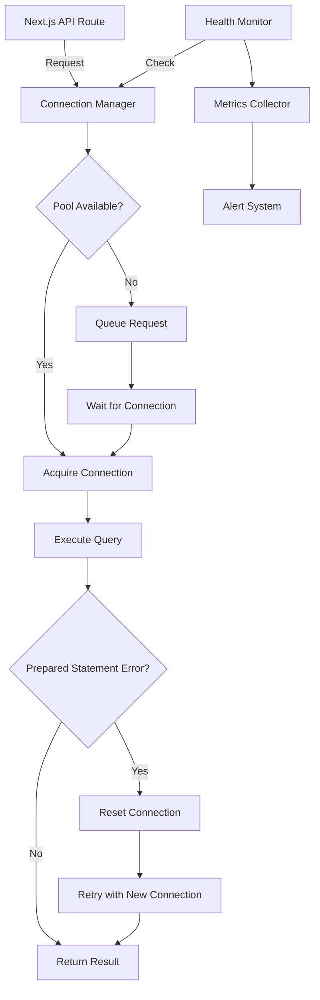

# Master Fix Planning Template v2.0

## TypeScript/Next.js/PostgreSQL Full Stack Development

### Prisma Prepared Statement Connection Pool Issue Fix

---

## 🎯 Feature/Fix Overview

**Name**: Prisma Prepared Statement Connection Pool Error Fix

**Type**: Bug Fix

**Priority**: Critical

**Estimated Complexity**: Medium (3-5 days)

**Sprint/Milestone**: HOTFIX-2025-Q3-SPRINT-1

### Problem Statement
Production application experiencing critical Prisma client errors with prepared statements ("prepared statement does not exist" and "prepared statement already exists") causing API failures across multiple endpoints including orders, spotlight picks, and catering orders. This indicates connection pool management issues between Prisma and PostgreSQL/Supabase.

### Success Criteria
- [ ] Zero prepared statement errors in production logs
- [ ] All affected API endpoints responding successfully (orders, spotlight-picks, webhooks)
- [ ] Database connection pool properly configured for Supabase pooler
- [ ] Monitoring in place for connection pool health
- [ ] Performance metrics remain within acceptable range (<200ms response time)

### Dependencies
- **Blocked by**: None (Critical production issue)
- **Blocks**: All order-related features, webhook processing
- **Related PRs/Issues**: N/A - Emergency hotfix

---

## 📋 Planning Phase

### 1. Code Structure & References

#### File Structure
```tsx
// Files to be modified/created
src/
├── lib/
│   ├── db/
│   │   ├── prisma.ts                 // Main Prisma client configuration
│   │   ├── prisma-edge.ts            // Edge-compatible client
│   │   ├── connection-manager.ts      // New connection pool manager
│   │   └── health-check.ts           // Database health monitoring
│   ├── monitoring/
│   │   └── db-metrics.ts             // Database performance metrics
├── app/
│   ├── api/
│   │   ├── user/
│   │   │   └── orders/
│   │   │       └── route.ts          // Fix order endpoint
│   │   ├── spotlight-picks/
│   │   │   └── route.ts              // Fix spotlight picks endpoint
│   │   ├── webhooks/
│   │   │   └── square/
│   │   │       └── route.ts          // Fix webhook handler
│   │   └── health/
│   │       └── db/
│   │           └── route.ts          // New health check endpoint
├── middleware.ts                      // Add connection pool monitoring
└── .env.production                   // Update database URLs

migrations/
└── connection_pool_config.sql        // PostgreSQL configuration updates
```

#### Key Interfaces & Types
```tsx
// types/database.ts
import { z } from 'zod';

// Connection pool configuration types
export interface DatabaseConfig {
  connectionString: string;
  pool: {
    min: number;
    max: number;
    idleTimeoutMillis: number;
    connectionTimeoutMillis: number;
    statementTimeout: number;
  };
  retryPolicy: RetryPolicy;
}

export interface RetryPolicy {
  maxRetries: number;
  initialDelayMs: number;
  maxDelayMs: number;
  backoffMultiplier: number;
}

// Connection health monitoring
export interface ConnectionHealth {
  status: 'healthy' | 'degraded' | 'unhealthy';
  activeConnections: number;
  idleConnections: number;
  waitingRequests: number;
  errors: ConnectionError[];
  lastChecked: Date;
}

export type ConnectionError = 
  | { type: 'PREPARED_STATEMENT_NOT_EXISTS'; code: '26000'; details: string }
  | { type: 'PREPARED_STATEMENT_EXISTS'; code: '42P05'; details: string }
  | { type: 'CONNECTION_TIMEOUT'; timeoutMs: number }
  | { type: 'POOL_EXHAUSTED'; waitTime: number };

// Result type for database operations
export type DatabaseResult<T> = 
  | { success: true; data: T; metrics?: QueryMetrics }
  | { success: false; error: ConnectionError; shouldRetry: boolean };

export interface QueryMetrics {
  queryTime: number;
  connectionAcquisitionTime: number;
  totalTime: number;
  preparedStatementCached: boolean;
}
```

#### Database Schema Updates
```sql
-- PostgreSQL connection pool configuration
-- Run these on Supabase dashboard SQL editor

-- Check current connection settings
SHOW max_connections;
SHOW max_prepared_statements;

-- For Supabase pooler, ensure proper pgBouncer configuration
-- These settings should be configured in Supabase dashboard
-- Pool Mode: Transaction (recommended for serverless)
-- Default Pool Size: 15
-- Max Client Connections: 100

-- Create connection monitoring table
CREATE TABLE IF NOT EXISTS connection_pool_metrics (
  id UUID PRIMARY KEY DEFAULT gen_random_uuid(),
  timestamp TIMESTAMPTZ NOT NULL DEFAULT NOW(),
  active_connections INT NOT NULL,
  idle_connections INT NOT NULL,
  waiting_requests INT NOT NULL,
  prepared_statements_count INT,
  errors JSONB,
  metadata JSONB
);

-- Index for time-series queries
CREATE INDEX idx_connection_pool_metrics_timestamp 
  ON connection_pool_metrics(timestamp DESC);

-- Retention policy (keep 7 days of metrics)
CREATE OR REPLACE FUNCTION cleanup_old_metrics() 
RETURNS void AS $$
BEGIN
  DELETE FROM connection_pool_metrics 
  WHERE timestamp < NOW() - INTERVAL '7 days';
END;
$$ LANGUAGE plpgsql;

-- Schedule cleanup (if pg_cron is enabled)
-- SELECT cron.schedule('cleanup-metrics', '0 0 * * *', 'SELECT cleanup_old_metrics()');
```

### 2. Architecture Patterns

#### Connection Pool Management Architecture


#### Error Handling Pattern
```tsx
// lib/db/connection-manager.ts
import { PrismaClient } from '@prisma/client';
import { Pool } from 'pg';

export class DatabaseConnectionManager {
  private prismaClient: PrismaClient | null = null;
  private pgPool: Pool | null = null;
  private connectionRetries = new Map<string, number>();
  
  constructor(private config: DatabaseConfig) {}

  async getConnection(): Promise<PrismaClient> {
    if (!this.prismaClient) {
      this.prismaClient = await this.createPrismaClient();
    }
    return this.prismaClient;
  }

  private async createPrismaClient(): Promise<PrismaClient> {
    const datasourceUrl = this.buildConnectionString();
    
    return new PrismaClient({
      datasources: {
        db: { url: datasourceUrl }
      },
      log: process.env.NODE_ENV === 'development' 
        ? ['query', 'error', 'warn'] 
        : ['error'],
      errorFormat: 'minimal',
    });
  }

  private buildConnectionString(): string {
    const url = new URL(this.config.connectionString);
    
    // Add pgBouncer-compatible parameters
    url.searchParams.set('pgbouncer', 'true');
    url.searchParams.set('connection_limit', String(this.config.pool.max));
    url.searchParams.set('pool_timeout', String(this.config.pool.connectionTimeoutMillis / 1000));
    url.searchParams.set('statement_timeout', String(this.config.pool.statementTimeout));
    
    // Disable prepared statements for pgBouncer transaction mode
    url.searchParams.set('prepare', 'false');
    
    return url.toString();
  }

  async executeWithRetry<T>(
    operation: (prisma: PrismaClient) => Promise<T>,
    operationId: string
  ): Promise<DatabaseResult<T>> {
    const maxRetries = this.config.retryPolicy.maxRetries;
    let lastError: ConnectionError | null = null;
    
    for (let attempt = 0; attempt <= maxRetries; attempt++) {
      try {
        const prisma = await this.getConnection();
        const startTime = Date.now();
        
        const data = await operation(prisma);
        
        const metrics: QueryMetrics = {
          queryTime: Date.now() - startTime,
          connectionAcquisitionTime: 0,
          totalTime: Date.now() - startTime,
          preparedStatementCached: false
        };
        
        // Reset retry counter on success
        this.connectionRetries.delete(operationId);
        
        return { success: true, data, metrics };
        
      } catch (error: any) {
        lastError = this.mapPrismaError(error);
        
        // Check if error is retryable
        if (!this.isRetryableError(error) || attempt === maxRetries) {
          return { 
            success: false, 
            error: lastError, 
            shouldRetry: false 
          };
        }
        
        // Exponential backoff
        const delay = this.calculateBackoff(attempt);
        console.warn(`Retrying operation ${operationId} after ${delay}ms (attempt ${attempt + 1}/${maxRetries})`);
        
        // Reset connection on prepared statement errors
        if (this.isPreparedStatementError(error)) {
          await this.resetConnection();
        }
        
        await new Promise(resolve => setTimeout(resolve, delay));
      }
    }
    
    return { 
      success: false, 
      error: lastError!, 
      shouldRetry: false 
    };
  }

  private mapPrismaError(error: any): ConnectionError {
    const code = error?.code || error?.meta?.code;
    
    if (code === '26000') {
      return {
        type: 'PREPARED_STATEMENT_NOT_EXISTS',
        code: '26000',
        details: error.message
      };
    }
    
    if (code === '42P05') {
      return {
        type: 'PREPARED_STATEMENT_EXISTS',
        code: '42P05',
        details: error.message
      };
    }
    
    if (error.message?.includes('timeout')) {
      return {
        type: 'CONNECTION_TIMEOUT',
        timeoutMs: this.config.pool.connectionTimeoutMillis
      };
    }
    
    return {
      type: 'POOL_EXHAUSTED',
      waitTime: 0
    };
  }

  private isRetryableError(error: any): boolean {
    const code = error?.code || error?.meta?.code;
    const retryableCodes = ['26000', '42P05', 'P1001', 'P1002'];
    return retryableCodes.includes(code);
  }

  private isPreparedStatementError(error: any): boolean {
    const code = error?.code || error?.meta?.code;
    return code === '26000' || code === '42P05';
  }

  private calculateBackoff(attempt: number): number {
    const { initialDelayMs, maxDelayMs, backoffMultiplier } = this.config.retryPolicy;
    const delay = initialDelayMs * Math.pow(backoffMultiplier, attempt);
    return Math.min(delay, maxDelayMs);
  }

  async resetConnection(): Promise<void> {
    console.log('Resetting database connection...');
    
    if (this.prismaClient) {
      await this.prismaClient.$disconnect();
      this.prismaClient = null;
    }
    
    if (this.pgPool) {
      await this.pgPool.end();
      this.pgPool = null;
    }
    
    // Wait a moment before allowing new connections
    await new Promise(resolve => setTimeout(resolve, 100));
  }

  async healthCheck(): Promise<ConnectionHealth> {
    try {
      const prisma = await this.getConnection();
      const startTime = Date.now();
      
      // Simple query to test connection
      await prisma.$queryRaw`SELECT 1`;
      
      const queryTime = Date.now() - startTime;
      
      // Get pool stats if available
      const poolStats = await this.getPoolStats();
      
      return {
        status: queryTime < 100 ? 'healthy' : queryTime < 500 ? 'degraded' : 'unhealthy',
        activeConnections: poolStats.active,
        idleConnections: poolStats.idle,
        waitingRequests: poolStats.waiting,
        errors: [],
        lastChecked: new Date()
      };
    } catch (error) {
      return {
        status: 'unhealthy',
        activeConnections: 0,
        idleConnections: 0,
        waitingRequests: 0,
        errors: [this.mapPrismaError(error)],
        lastChecked: new Date()
      };
    }
  }

  private async getPoolStats() {
    // This would integrate with pgBouncer stats or Supabase metrics
    return {
      active: 0,
      idle: 0,
      waiting: 0
    };
  }

  async shutdown(): Promise<void> {
    console.log('Shutting down database connections...');
    await this.resetConnection();
  }
}
```

### 3. Full Stack Integration Points

#### Updated Prisma Client Singleton
```tsx
// lib/db/prisma.ts
import { DatabaseConnectionManager } from './connection-manager';
import type { DatabaseConfig } from '@/types/database';

const globalForPrisma = globalThis as unknown as {
  connectionManager: DatabaseConnectionManager | undefined;
};

const config: DatabaseConfig = {
  connectionString: process.env.DATABASE_URL!,
  pool: {
    min: 2,
    max: parseInt(process.env.DATABASE_POOL_MAX || '10'),
    idleTimeoutMillis: 30000,
    connectionTimeoutMillis: 5000,
    statementTimeout: 30000
  },
  retryPolicy: {
    maxRetries: 3,
    initialDelayMs: 100,
    maxDelayMs: 2000,
    backoffMultiplier: 2
  }
};

export const connectionManager = 
  globalForPrisma.connectionManager ??
  new DatabaseConnectionManager(config);

if (process.env.NODE_ENV !== 'production') {
  globalForPrisma.connectionManager = connectionManager;
}

// Export a helper function for database operations
export async function withDatabase<T>(
  operation: (prisma: any) => Promise<T>,
  operationId?: string
): Promise<T> {
  const result = await connectionManager.executeWithRetry(
    operation,
    operationId || `op_${Date.now()}`
  );
  
  if (!result.success) {
    throw new Error(`Database operation failed: ${JSON.stringify(result.error)}`);
  }
  
  return result.data;
}

// Graceful shutdown
process.on('SIGTERM', async () => {
  await connectionManager.shutdown();
});
```

#### Fixed API Routes
```tsx
// app/api/user/orders/route.ts
import { NextRequest, NextResponse } from 'next/server';
import { withDatabase } from '@/lib/db/prisma';
import { getServerSession } from 'next-auth';
import { z } from 'zod';

const OrderQuerySchema = z.object({
  page: z.coerce.number().min(1).default(1),
  limit: z.coerce.number().min(1).max(100).default(10),
  status: z.enum(['pending', 'completed', 'cancelled']).optional()
});

export async function GET(request: NextRequest) {
  try {
    // Get user session
    const session = await getServerSession();
    if (!session?.user?.id) {
      return NextResponse.json(
        { error: 'Unauthorized' },
        { status: 401 }
      );
    }

    // Parse query parameters
    const searchParams = Object.fromEntries(request.nextUrl.searchParams);
    const query = OrderQuerySchema.parse(searchParams);

    // Execute database operation with retry logic
    const orders = await withDatabase(
      async (prisma) => {
        return prisma.order.findMany({
          where: {
            userId: session.user.id,
            ...(query.status && { status: query.status })
          },
          skip: (query.page - 1) * query.limit,
          take: query.limit,
          orderBy: {
            createdAt: 'desc'
          },
          include: {
            items: true
          }
        });
      },
      `get_user_orders_${session.user.id}`
    );

    // Get total count for pagination
    const totalCount = await withDatabase(
      async (prisma) => {
        return prisma.order.count({
          where: {
            userId: session.user.id,
            ...(query.status && { status: query.status })
          }
        });
      },
      `count_user_orders_${session.user.id}`
    );

    return NextResponse.json({
      orders,
      pagination: {
        page: query.page,
        limit: query.limit,
        total: totalCount,
        totalPages: Math.ceil(totalCount / query.limit)
      }
    });

  } catch (error: any) {
    console.error('Error fetching user orders:', error);
    
    // Return appropriate error response
    if (error.message?.includes('Database operation failed')) {
      return NextResponse.json(
        { error: 'Database connection issue. Please try again.' },
        { status: 503 }
      );
    }

    return NextResponse.json(
      { error: 'Failed to fetch orders' },
      { status: 500 }
    );
  }
}
```

```tsx
// app/api/spotlight-picks/route.ts
import { NextRequest, NextResponse } from 'next/server';
import { withDatabase } from '@/lib/db/prisma';
import { unstable_cache } from 'next/cache';

// Cache spotlight picks for 5 minutes
const getSpotlightPicks = unstable_cache(
  async () => {
    return withDatabase(
      async (prisma) => {
        return prisma.spotlightPick.findMany({
          where: {
            isActive: true,
            validFrom: {
              lte: new Date()
            },
            validUntil: {
              gte: new Date()
            }
          },
          orderBy: {
            priority: 'asc'
          },
          take: 10
        });
      },
      'get_spotlight_picks'
    );
  },
  ['spotlight-picks'],
  {
    revalidate: 300, // 5 minutes
    tags: ['spotlight-picks']
  }
);

export async function GET(request: NextRequest) {
  try {
    const picks = await getSpotlightPicks();
    
    return NextResponse.json({
      picks,
      cachedAt: new Date().toISOString()
    });

  } catch (error: any) {
    console.error('Error fetching spotlight picks:', error);
    
    return NextResponse.json(
      { error: 'Failed to fetch spotlight picks' },
      { status: 500 }
    );
  }
}
```

---

## 🧪 Testing Strategy

### Testing Pyramid
```
         /\
        /  \  E2E Tests (Critical user flows with orders)
       /----\
      /      \  Integration Tests (Database connections, API endpoints)
     /--------\
    /          \  Unit Tests (Connection manager, retry logic)
   /____________\
```

### Unit Tests
```tsx
// lib/db/connection-manager.test.ts
import { DatabaseConnectionManager } from './connection-manager';
import { PrismaClient } from '@prisma/client';

describe('DatabaseConnectionManager', () => {
  let manager: DatabaseConnectionManager;
  
  beforeEach(() => {
    manager = new DatabaseConnectionManager({
      connectionString: process.env.TEST_DATABASE_URL!,
      pool: {
        min: 1,
        max: 5,
        idleTimeoutMillis: 10000,
        connectionTimeoutMillis: 3000,
        statementTimeout: 5000
      },
      retryPolicy: {
        maxRetries: 2,
        initialDelayMs: 50,
        maxDelayMs: 500,
        backoffMultiplier: 2
      }
    });
  });

  afterEach(async () => {
    await manager.shutdown();
  });

  describe('Prepared Statement Error Handling', () => {
    it('should retry on prepared statement does not exist error', async () => {
      const mockOperation = jest.fn()
        .mockRejectedValueOnce({
          code: '26000',
          message: 'prepared statement "s0" does not exist'
        })
        .mockResolvedValueOnce({ id: '123' });

      const result = await manager.executeWithRetry(
        mockOperation,
        'test_operation'
      );

      expect(result.success).toBe(true);
      expect(mockOperation).toHaveBeenCalledTimes(2);
    });

    it('should retry on prepared statement already exists error', async () => {
      const mockOperation = jest.fn()
        .mockRejectedValueOnce({
          code: '42P05',
          message: 'prepared statement "s0" already exists'
        })
        .mockResolvedValueOnce({ id: '456' });

      const result = await manager.executeWithRetry(
        mockOperation,
        'test_operation'
      );

      expect(result.success).toBe(true);
      expect(mockOperation).toHaveBeenCalledTimes(2);
    });

    it('should respect max retries limit', async () => {
      const mockOperation = jest.fn()
        .mockRejectedValue({
          code: '26000',
          message: 'prepared statement error'
        });

      const result = await manager.executeWithRetry(
        mockOperation,
        'test_operation'
      );

      expect(result.success).toBe(false);
      expect(mockOperation).toHaveBeenCalledTimes(3); // initial + 2 retries
    });
  });

  describe('Connection Health Check', () => {
    it('should report healthy status for fast queries', async () => {
      const health = await manager.healthCheck();
      
      expect(health.status).toBeDefined();
      expect(['healthy', 'degraded', 'unhealthy']).toContain(health.status);
    });
  });
});
```

### Integration Tests
```tsx
// app/api/user/orders/route.test.ts
import { GET } from './route';
import { NextRequest } from 'next/server';

describe('Orders API Endpoint', () => {
  it('should handle database connection errors gracefully', async () => {
    const request = new NextRequest('http://localhost:3000/api/user/orders');
    
    // Mock session
    jest.spyOn(require('next-auth'), 'getServerSession').mockResolvedValue({
      user: { id: 'test-user-id' }
    });
    
    const response = await GET(request);
    const data = await response.json();
    
    expect(response.status).toBeLessThan(500);
    expect(data).toBeDefined();
  });
});
```

### Load Testing Script
```typescript
// scripts/load-test-db.ts
import { createPool } from 'pg';

async function loadTestDatabase() {
  const pool = createPool({
    connectionString: process.env.DATABASE_URL,
    max: 50,
    min: 5
  });

  const promises = [];
  
  // Simulate 100 concurrent queries
  for (let i = 0; i < 100; i++) {
    promises.push(
      pool.query('SELECT * FROM orders WHERE user_id = $1 LIMIT 10', [
        'test-user-id'
      ])
    );
  }

  try {
    const start = Date.now();
    await Promise.all(promises);
    const duration = Date.now() - start;
    
    console.log(`✅ Completed 100 queries in ${duration}ms`);
    console.log(`Average: ${duration / 100}ms per query`);
  } catch (error) {
    console.error('❌ Load test failed:', error);
  } finally {
    await pool.end();
  }
}

loadTestDatabase();
```

---

## 🔒 Security Analysis

### Security Checklist
- [x] **Connection String Security**: Use environment variables, never hardcode
- [x] **SSL/TLS**: Enforce SSL for database connections
- [x] **Connection Limits**: Prevent connection pool exhaustion attacks
- [x] **Statement Timeout**: Prevent long-running queries
- [x] **Input Validation**: Parameterized queries prevent SQL injection
- [x] **Error Messages**: Don't expose internal database errors to clients
- [x] **Monitoring**: Track failed connection attempts
- [x] **Graceful Degradation**: Service remains partially functional during DB issues

### Security Configuration
```tsx
// lib/db/security-config.ts
export const databaseSecurityConfig = {
  // Require SSL in production
  ssl: process.env.NODE_ENV === 'production' ? {
    rejectUnauthorized: true
  } : false,
  
  // Connection limits per IP
  connectionLimits: {
    perIp: 10,
    total: 100
  },
  
  // Query complexity limits
  queryLimits: {
    maxDepth: 5,
    maxComplexity: 100,
    timeout: 30000
  },
  
  // Audit logging
  auditLog: {
    enabled: true,
    logFailedQueries: true,
    logSlowQueries: true,
    slowQueryThreshold: 1000
  }
};
```

---

## 📊 Performance & Monitoring

### Performance Budget
```yaml
performance:
  database_query_p50: < 50ms
  database_query_p95: < 200ms
  database_query_p99: < 500ms
  connection_acquisition: < 100ms
  api_response_time: < 300ms
  error_rate: < 0.1%
```

### Monitoring Implementation
```tsx
// lib/monitoring/db-metrics.ts
import { connectionManager } from '@/lib/db/prisma';

export class DatabaseMetrics {
  private metricsInterval: NodeJS.Timeout | null = null;
  
  startCollection() {
    this.metricsInterval = setInterval(async () => {
      try {
        const health = await connectionManager.healthCheck();
        
        // Log to monitoring service (DataDog, New Relic, etc.)
        await this.sendMetrics({