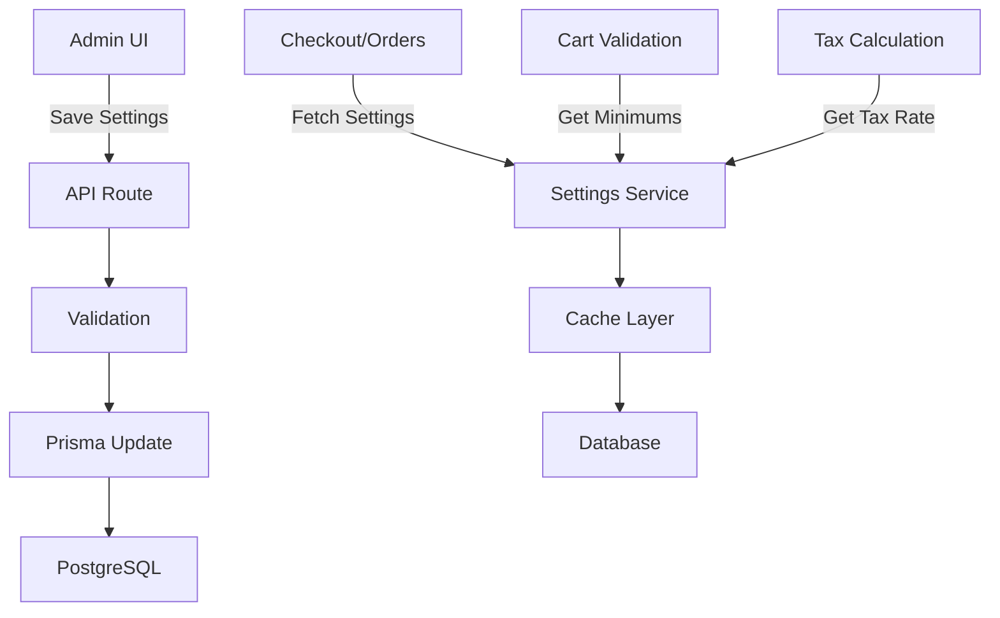

# Master Fix Plan: Admin Settings Integration

## 🎯 Feature/Fix Overview

**Name**: Admin Settings Database Integration

**Type**: Bug Fix / Critical Infrastructure

**Priority**: Critical

**Estimated Complexity**: Large (1+ week)

**Sprint/Milestone**: Admin Panel Functionality

### Problem Statement
The admin settings panel exists in the UI but is completely disconnected from the database and application logic. Settings cannot be saved, and hardcoded values are used throughout the application instead of the admin-configured values.

### Success Criteria
- [x] Admin settings save to database successfully
- [x] Tax rate from settings is applied to all orders
- [x] Order minimums are enforced from settings
- [x] Store open/closed status is checked from settings
- [x] Delivery zones affect pricing and validation

### Dependencies
- **Blocked by**: None
- **Blocks**: Order processing accuracy, Revenue calculations
- **Related PRs/Issues**: N/A

---

## 📋 Planning Phase

### 1. Code Structure & References

#### File Structure
```tsx
src/
├── app/
│   ├── api/
│   │   └── admin/
│   │       └── settings/
│   │           └── route.ts              // ❌ References non-existent model
│   ├── (dashboard)/
│   │   └── admin/
│   │       └── settings/
│   │           └── page.tsx              // ❌ Can't fetch settings
│   └── actions/
│       └── orders.ts                     // ❌ Uses hardcoded values
├── components/
│   └── admin/
│       ├── AdminSettingsTabs.tsx         // ✅ UI works
│       └── EnhancedStoreSettingsForm.tsx // ❌ Can't save to DB
├── lib/
│   ├── store-settings.ts                 // 🆕 TO BE CREATED
│   └── cart-helpers.ts                   // ❌ Doesn't use settings
└── prisma/
    └── schema.prisma                      // ❌ Missing StoreSettings model
```

#### Key Interfaces & Types
```tsx
// types/store-settings.ts (TO BE CREATED)
import { z } from 'zod';

export const StoreSettingsSchema = z.object({
  id: z.string().uuid(),
  name: z.string().min(1),
  address: z.string().nullable(),
  city: z.string().nullable(),
  state: z.string().nullable(),
  zipCode: z.string().nullable(),
  phone: z.string().nullable(),
  email: z.string().email().nullable(),
  taxRate: z.number().min(0).max(100),
  minOrderAmount: z.number().min(0),
  cateringMinimumAmount: z.number().min(0),
  minAdvanceHours: z.number().int().min(0),
  maxDaysInAdvance: z.number().int().min(1),
  isStoreOpen: z.boolean(),
  temporaryClosureMsg: z.string().nullable(),
  createdAt: z.date(),
  updatedAt: z.date(),
});

export type StoreSettings = z.infer<typeof StoreSettingsSchema>;

// Result type for settings operations
export type SettingsResult<T = StoreSettings> = 
  | { success: true; data: T }
  | { success: false; error: string };
```

#### Database Schema
```sql
-- migrations/[timestamp]_add_store_settings.sql
CREATE TABLE IF NOT EXISTS store_settings (
  id UUID PRIMARY KEY DEFAULT gen_random_uuid(),
  name VARCHAR(255) NOT NULL,
  address VARCHAR(255),
  city VARCHAR(100),
  state VARCHAR(50),
  zip_code VARCHAR(20),
  phone VARCHAR(50),
  email VARCHAR(255),
  tax_rate DECIMAL(5,2) DEFAULT 8.25,
  min_order_amount DECIMAL(10,2) DEFAULT 0,
  catering_minimum_amount DECIMAL(10,2) DEFAULT 0,
  min_advance_hours INTEGER DEFAULT 24,
  max_days_in_advance INTEGER DEFAULT 30,
  is_store_open BOOLEAN DEFAULT true,
  temporary_closure_msg TEXT,
  created_at TIMESTAMPTZ NOT NULL DEFAULT NOW(),
  updated_at TIMESTAMPTZ NOT NULL DEFAULT NOW()
);

-- Ensure only one settings record exists
CREATE UNIQUE INDEX idx_store_settings_singleton ON store_settings((1));

-- Trigger for updated_at
CREATE TRIGGER update_store_settings_updated_at
  BEFORE UPDATE ON store_settings
  FOR EACH ROW
  EXECUTE FUNCTION update_updated_at_column();
```

### 2. Architecture Patterns

#### Data Flow Architecture


#### Settings Service Pattern
```tsx
// lib/store-settings.ts
import { prisma } from '@/lib/db';
import { unstable_cache } from 'next/cache';
import type { StoreSettings } from '@/types/store-settings';

// Cache settings for 5 minutes
export const getStoreSettings = unstable_cache(
  async (): Promise<StoreSettings> => {
    const settings = await prisma.storeSettings.findFirst();
    
    if (!settings) {
      // Return defaults if no settings exist
      return getDefaultSettings();
    }
    
    return {
      ...settings,
      taxRate: Number(settings.taxRate),
      minOrderAmount: Number(settings.minOrderAmount),
      cateringMinimumAmount: Number(settings.cateringMinimumAmount),
    };
  },
  ['store-settings'],
  {
    revalidate: 300, // 5 minutes
    tags: ['store-settings'],
  }
);

export async function invalidateSettingsCache() {
  revalidatePath('/', 'layout');
  revalidateTag('store-settings');
}
```

### 3. Full Stack Integration Points

#### API Endpoints
```tsx
// GET /api/admin/settings - Fetch current settings
// POST /api/admin/settings - Update settings (admin only)
// GET /api/public/store-status - Check if store is open
```

#### Integration Points
1. **Order Creation** (`/src/app/actions/orders.ts`)
   - Replace `const TAX_RATE = new Decimal(0.0825)` with settings lookup
   - Check `isStoreOpen` before accepting orders
   
2. **Cart Validation** (`/src/lib/cart-helpers.ts`)
   - Fetch `minOrderAmount` from settings
   - Apply `cateringMinimumAmount` for catering orders
   
3. **Checkout** (`/src/components/store/CheckoutForm.tsx`)
   - Display store closed message if applicable
   - Validate against minimum amounts
   
4. **Email Notifications**
   - Use store email/phone from settings
   - Include store address in confirmations

---

## 🧪 Testing Strategy

### Unit Tests
```tsx
// __tests__/store-settings.test.ts
describe('Store Settings Service', () => {
  it('returns default settings when none exist', async () => {
    const settings = await getStoreSettings();
    expect(settings.taxRate).toBe(8.25);
  });
  
  it('caches settings appropriately', async () => {
    // Test cache behavior
  });
  
  it('validates settings on save', async () => {
    // Test validation rules
  });
});
```

### Integration Tests
```tsx
describe('Settings Integration', () => {
  it('applies tax rate from settings to orders', async () => {
    await updateStoreSettings({ taxRate: 10.5 });
    const order = await createOrder(mockItems);
    expect(order.taxAmount).toBe(calculateTax(mockItems, 10.5));
  });
  
  it('enforces minimum order amounts', async () => {
    await updateStoreSettings({ minOrderAmount: 50 });
    const result = await validateOrder(smallOrder);
    expect(result.isValid).toBe(false);
    expect(result.errorMessage).toContain('minimum');
  });
});
```

---

## 🔒 Security Analysis

### Security Checklist
- [x] **Authorization**: Only admins can modify settings
- [x] **Validation**: Zod schema validates all inputs
- [x] **Audit Trail**: Log all settings changes
- [x] **Rate Limiting**: Prevent settings spam
- [x] **Cache Invalidation**: Proper cache clearing on updates

---

## 📊 Performance & Monitoring

### Performance Considerations
- Cache settings for 5 minutes to reduce DB queries
- Use database singleton pattern (only one settings record)
- Index frequently queried fields

### Monitoring
```tsx
// Track settings usage
export async function trackSettingsUsage(field: string) {
  await prisma.businessMetric.create({
    data: {
      metric: `settings_usage_${field}`,
      value: 1,
      date: new Date(),
    }
  });
}
```

---

## 🚀 Implementation Steps

### Phase 1: Database (Day 1)
1. Add `StoreSettings` model to Prisma schema
2. Generate and run migration
3. Seed initial settings record
4. Verify Prisma client generation

### Phase 2: Service Layer (Day 2)
1. Create `store-settings.ts` service
2. Implement caching strategy
3. Add settings validation
4. Create helper functions

### Phase 3: Integration (Day 3-4)
1. Update order processing to use settings
2. Modify cart validation
3. Update checkout flow
4. Fix tax calculations

### Phase 4: Testing (Day 5)
1. Write unit tests
2. Integration testing
3. Manual QA testing
4. Performance testing

---

## 📦 Deployment & Rollback

### Pre-Deployment Checklist
- [ ] Database backup created
- [ ] Migration tested on staging
- [ ] Settings seeded with current values
- [ ] Feature flag ready if needed
- [ ] Monitoring alerts configured

### Rollback Strategy
```sql
-- Rollback migration if needed
DROP TABLE IF EXISTS store_settings;

-- Restore hardcoded values in code
-- Revert to previous deployment
```

---

## 📚 Documentation

### Admin User Guide
```markdown
## Store Settings Management

### Overview
Configure global store settings that affect all operations.

### Available Settings
- **Store Information**: Name, address, contact details
- **Tax Configuration**: Sales tax rate (percentage)
- **Order Minimums**: Regular and catering minimums
- **Store Hours**: Open/closed status and messages
- **Advance Booking**: How far ahead orders can be placed

### How Settings Are Applied
- Tax rate: Applied to all taxable items at checkout
- Minimums: Enforced before order submission
- Store status: Blocks orders when closed
```

---

## ⚠️ Known Issues & Risks

1. **Missing Model**: StoreSettings doesn't exist in current schema
2. **Hardcoded Values**: Tax rate and minimums are hardcoded
3. **No Migration History**: Table may need to be created from scratch
4. **Cache Invalidation**: Must ensure settings updates propagate
5. **Backwards Compatibility**: Existing orders use old tax rates

## 🎯 Definition of Done

- [ ] StoreSettings model added to Prisma schema
- [ ] Migration successfully applied to all environments
- [ ] Settings service created and tested
- [ ] All hardcoded values replaced with settings lookups
- [ ] Admin can save and modify settings
- [ ] Settings changes immediately affect new orders
- [ ] Documentation updated
- [ ] Tests passing with >80% coverage
- [ ] Performance metrics within acceptable range
- [ ] No regression in existing functionality