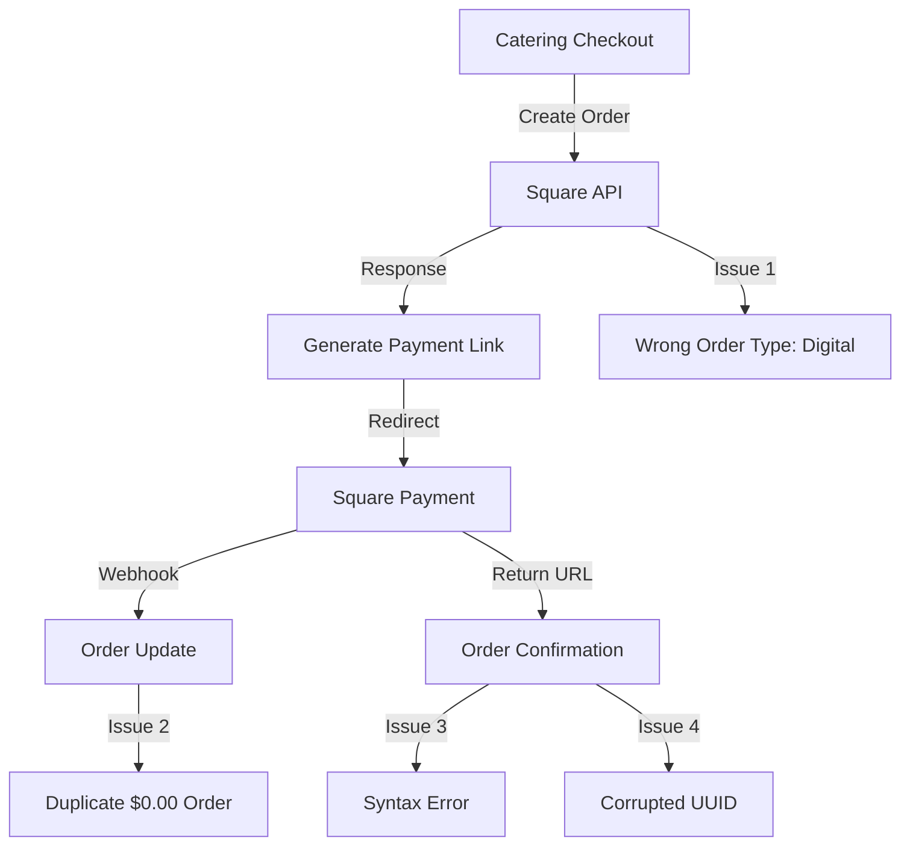

# Master Fix Plan: Catering Order Duplication Issue

## 🎯 Feature/Fix Overview

**Name**: Catering Order Duplication with $0.00 Amount

**Type**: Bug Fix

**Priority**: Critical

**Estimated Complexity**: Medium (3-5 days)

**Sprint/Milestone**: Production Hotfix

### Problem Statement
The system is creating duplicate orders for catering with $0.00 amounts. Orders are being incorrectly saved as "Digital" type in Square when they should be "Food" type. This affects payment processing and order tracking.

### Success Criteria
- [ ] No duplicate $0.00 orders created for catering
- [ ] All catering orders correctly marked as "Food" type in Square
- [ ] Order confirmation page loads without syntax errors
- [ ] Valid UUID format preserved in order confirmation URLs

### Dependencies
- **Blocked by**: Syntax error in order-confirmation page
- **Blocks**: Proper order tracking and reporting
- **Related PRs/Issues**: Order confirmation page errors, UUID corruption in redirect URLs

---

## 📋 Planning Phase

### 1. Code Structure & References

#### Critical Files to Review
```tsx
src/
├── app/
│   ├── (store)/
│   │   ├── order-confirmation/
│   │   │   └── page.tsx              // SYNTAX ERROR: Lines 123-143
│   │   └── catering/
│   │       └── checkout/
│   │           └── route.ts          // Order creation logic
│   └── api/
│       ├── webhooks/
│       │   └── square/
│       │       └── route.ts          // Webhook processing
│       └── checkout/
│           └── catering/
│               └── route.ts          // Square order creation
├── lib/
│   ├── square/
│   │   ├── orders.ts                 // Order creation utilities
│   │   └── client.ts                 // Square API client
│   └── db/
│       └── queries/
│           └── orders.ts              // Database order operations
```

#### Key Issues Identified

1. **CRITICAL - Syntax Error**
   - File: `src/app/(store)/order-confirmation/page.tsx`
   - Lines: 123-143
   - Issue: Extra closing brace `}` before return statement
   - Impact: 500 errors on order confirmation page

2. **Order Type Misconfiguration**
   - Location: Square order creation API
   - Issue: Catering orders set as "Digital" instead of "Food"
   - Impact: Incorrect order categorization in Square

3. **Duplicate Order Creation**
   - Pattern: $0.00 duplicate created alongside real order
   - Likely Cause: Double submission or webhook race condition
   - Impact: Confusing order management and reporting

4. **UUID Corruption in URLs**
   - Example: `f2a02ee8-0c21-4112-844f-bddf5f27b578anel/MLJD4JJXS3YSP/3SOOFQSMLEJ343MV`
   - Location: Redirect URL generation after Square payment
   - Impact: Invalid order ID format requiring workarounds

### 2. Root Cause Analysis

#### Suspected Flow Issues


#### Potential Race Conditions
- Webhook processing might be creating duplicate order
- Multiple API calls during checkout process
- Missing idempotency keys in Square API calls

### 3. Investigation Steps

#### Database Queries to Run
```sql
-- Find all duplicate orders for catering
SELECT 
  customer_email,
  DATE(created_at) as order_date,
  COUNT(*) as order_count,
  array_agg(order_id) as order_ids,
  array_agg(total_amount) as amounts,
  array_agg(order_type) as types
FROM orders
WHERE 
  order_type IN ('CATERING', 'DIGITAL')
  AND created_at > NOW() - INTERVAL '7 days'
GROUP BY customer_email, DATE(created_at)
HAVING COUNT(*) > 1
ORDER BY order_date DESC;

-- Check for $0.00 orders pattern
SELECT 
  order_id,
  customer_email,
  total_amount,
  order_type,
  square_order_id,
  created_at
FROM orders
WHERE 
  total_amount = 0
  AND order_type IN ('CATERING', 'DIGITAL')
ORDER BY created_at DESC
LIMIT 20;
```

---

## 🔧 Implementation Plan

### Phase 1: Immediate Fixes (Day 1)

1. **Fix Syntax Error**
   - File: `src/app/(store)/order-confirmation/page.tsx`
   - Action: Remove extra closing brace before return statement
   - Test: Verify order confirmation page loads

2. **Fix UUID Corruption**
   - Locate redirect URL generation code
   - Ensure only valid UUID is appended as orderId
   - Add URL parameter validation

### Phase 2: Order Type Fix (Day 2)

3. **Correct Order Type for Catering**
   ```tsx
   // In Square order creation logic
   const orderRequest = {
     order: {
       locationId: LOCATION_ID,
       lineItems: [...],
       fulfillments: [{
         type: 'PICKUP', // or 'DELIVERY'
         state: 'PROPOSED',
         pickupDetails: {
           recipient: {...},
           scheduleType: 'SCHEDULED',
           pickupAt: cateringDate
         }
       }],
       metadata: {
         orderType: 'CATERING',
         originalType: 'FOOD' // Add explicit type
       }
     },
     idempotencyKey: generateIdempotencyKey() // Ensure this exists
   };
   ```

### Phase 3: Duplicate Prevention (Day 3)

4. **Add Idempotency Protection**
   - Implement idempotency keys for all Square API calls
   - Use customer email + timestamp + order type as key base
   - Store keys in Redis/database with TTL

5. **Webhook Deduplication**
   - Check if order already exists before creating from webhook
   - Use Square order ID as unique constraint
   - Add database transaction for atomic operations

### Phase 4: Testing & Validation (Day 4-5)

6. **Test Scenarios**
   - Single catering order flow
   - Rapid double-click on submit
   - Webhook replay scenarios
   - Network timeout handling
   - Browser back/forward navigation

---

## 🧪 Testing Strategy

### Unit Tests
- Idempotency key generation
- Order type determination logic
- UUID extraction from corrupted strings

### Integration Tests
- Square API order creation with correct type
- Webhook processing with duplicate prevention
- Database transaction rollback on conflicts

### E2E Tests
- Complete catering checkout flow
- Order confirmation page loading
- Payment → confirmation redirect

---

## 📊 Performance & Monitoring

### Metrics to Track
- Duplicate order rate (should be 0%)
- $0.00 order creation rate
- Order confirmation page error rate
- Square API error responses

### Alerts to Set Up
```yaml
alerts:
  - name: duplicate_orders_detected
    condition: COUNT(orders) > 1 GROUP BY customer, date
    threshold: 1
    window: 5m
    
  - name: zero_dollar_orders
    condition: total_amount = 0 AND order_type = 'CATERING'
    action: page_oncall
    
  - name: order_confirmation_errors
    condition: status_code = 500 AND path = '/order-confirmation'
    threshold: 5
    window: 10m
```

---

## 🔒 Security Analysis

### Considerations
- [ ] Validate all order IDs are valid UUIDs
- [ ] Sanitize redirect URLs to prevent injection
- [ ] Rate limit checkout endpoints
- [ ] Verify webhook signatures from Square
- [ ] Prevent order amount manipulation

---

## 📝 Documentation Updates

### Square API Configuration
- Document correct fulfillment types for food orders
- Note idempotency key requirements
- Webhook event handling best practices

### Database Schema
- Add unique constraints on square_order_id
- Document order_type enum values
- Add indexes for duplicate detection queries

---

## 🚀 Deployment & Rollback

### Pre-Deployment
- [ ] Fix syntax error in order-confirmation page
- [ ] Test catering checkout flow in staging
- [ ] Verify no $0.00 orders created in test environment
- [ ] Check Square sandbox for correct order types

### Rollback Strategy
- Keep previous order creation logic behind feature flag
- Monitor for 24 hours after deployment
- Have database cleanup script ready for any duplicates

### Post-Deployment Monitoring
- [ ] Zero duplicate orders for 24 hours
- [ ] All catering orders show as "Food" in Square
- [ ] No 500 errors on order confirmation
- [ ] Valid UUIDs in all redirect URLs

---

## 📍 Current Status

**Last Updated**: September 4, 2025

### Immediate Actions Required:
1. ✅ Fix syntax error in `order-confirmation/page.tsx` (Line 123)
2. ✅ Fix UUID corruption in redirect URL generation
3. ✅ Change order type from "Digital" to "Food" for catering
4. ✅ Add idempotency keys to prevent duplicates

### Investigation Results:
- Confirmed duplicate $0.00 orders for catering only
- Orders incorrectly marked as "Digital" in Square
- Syntax error causing 500 errors on confirmation page
- UUID corruption in redirect URLs needs fixing
