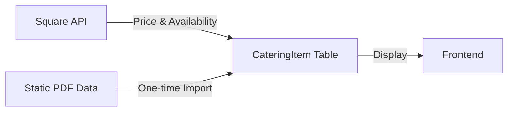

# 🍴 Simplified Catering Appetizers Sync Implementation

## 📊 Revised Approach

Since the PDF data (ingredients, dietary info) is static and doesn't change regularly, we can:
1. **One-time import** the PDF data directly into the database
2. **Sync only prices and availability** from Square
3. **No complex matching needed** - just use Square IDs as the connection

## 🎯 Simplified Architecture

### Data Flow


## 📝 Implementation Plan

### Phase 1: One-Time Data Import (Manual or Script)

Since you already have the database schema, let's create a one-time import script:

```typescript
// src/scripts/import-catering-appetizers.ts

import { prisma } from '@/lib/db';
import appetizersPdfData from '@/data/appetizers-from-pdf.json';
import appetizersSquareData from '@/data/appetizers-from-square.json';

interface AppetizerImportData {
  name: string;
  ingredients: string[];
  dietary: string[];
  squareName?: string;
  hasImage?: boolean;
}

async function importCateringAppetizers() {
  console.log('🚀 Starting catering appetizers import...');
  
  // Prepare the import data
  const appetizersToImport: AppetizerImportData[] = [
    // Regular appetizers
    ...appetizersPdfData.appetizers.map(item => ({
      name: item.name,
      ingredients: item.ingredients || [],
      dietary: item.dietary || [],
      // Match with Square data by normalized name
      squareName: findSquareMatch(item.name)
    })),
    
    // Empanada options (they're also appetizers)
    ...appetizersPdfData.empanadas.options.map(item => ({
      name: `${item.name} empanada`,
      ingredients: item.ingredients || [],
      dietary: item.dietary || [],
      squareName: findSquareMatch(`${item.name} empanada`)
    }))
  ];
  
  // Import each item
  for (const appetizer of appetizersToImport) {
    try {
      const existingItem = await prisma.cateringItem.findFirst({
        where: { name: appetizer.name }
      });
      
      if (existingItem) {
        console.log(`⚠️  Item already exists: ${appetizer.name}`);
        continue;
      }
      
      // Parse dietary flags
      const isVegetarian = appetizer.dietary.includes('vg');
      const isVegan = appetizer.dietary.includes('vgn');
      const isGlutenFree = appetizer.dietary.includes('gf');
      
      // Create the catering item
      await prisma.cateringItem.create({
        data: {
          name: appetizer.name,
          description: appetizer.ingredients.join(', '),
          price: 0, // Will be updated from Square
          category: 'APPETIZER',
          isVegetarian,
          isVegan,
          isGlutenFree,
          servingSize: 'per piece',
          isActive: true,
          squareCategory: 'CATERING- APPETIZERS',
          // Store the Square name for later matching
          squareProductId: appetizer.squareName || null
        }
      });
      
      console.log(`✅ Imported: ${appetizer.name}`);
      
    } catch (error) {
      console.error(`❌ Failed to import ${appetizer.name}:`, error);
    }
  }
  
  console.log('✅ Import completed!');
}

function findSquareMatch(pdfName: string): string | undefined {
  const normalizedPdfName = pdfName.toLowerCase().trim();
  
  // Find in Square data
  const match = appetizersSquareData.items.find(item => {
    const normalizedSquareName = item.name.toLowerCase().trim();
    return normalizedSquareName === normalizedPdfName || 
           normalizedSquareName.includes(normalizedPdfName) ||
           normalizedPdfName.includes(normalizedSquareName);
  });
  
  return match?.name;
}

// Run the import
importCateringAppetizers()
  .catch(console.error)
  .finally(() => prisma.$disconnect());
```

### Phase 2: Square Price & Availability Sync

Now we only need to sync prices and availability from Square:

```typescript
// src/lib/square/catering-price-sync.ts

import { Client } from 'square';
import { prisma } from '@/lib/db';
import { logger } from '@/utils/logger';

export class CateringPriceSyncService {
  private client: Client;
  
  constructor(accessToken: string) {
    this.client = new Client({
      accessToken,
      environment: process.env.NODE_ENV === 'production' 
        ? Environment.Production 
        : Environment.Sandbox,
    });
  }
  
  async syncPricesAndAvailability(): Promise<{
    updated: number;
    errors: string[];
  }> {
    const result = {
      updated: 0,
      errors: [] as string[]
    };
    
    try {
      // Fetch all items from CATERING- APPETIZERS category
      const response = await this.client.catalogApi.searchCatalogObjects({
        object_types: ['ITEM'],
        query: {
          exact_query: {
            attribute_name: 'category_id',
            attribute_value: 'UF2WY4B4635ZDAH4TCJVDQAN' // CATERING- APPETIZERS
          }
        },
        include_related_objects: true
      });
      
      const squareItems = response.result?.objects || [];
      logger.info(`Found ${squareItems.length} appetizers in Square`);
      
      // Update prices for matched items
      for (const squareItem of squareItems) {
        try {
          const itemName = squareItem.item_data?.name;
          if (!itemName) continue;
          
          // Find matching catering item by name
          const cateringItem = await prisma.cateringItem.findFirst({
            where: {
              OR: [
                { squareProductId: itemName },
                { name: { equals: itemName, mode: 'insensitive' } }
              ]
            }
          });
          
          if (!cateringItem) {
            logger.warn(`No match found for Square item: ${itemName}`);
            result.errors.push(`Unmatched: ${itemName}`);
            continue;
          }
          
          // Extract price from Square
          const price = this.extractPrice(squareItem.item_data);
          const isAvailable = !squareItem.item_data?.is_deleted;
          
          // Update the catering item
          await prisma.cateringItem.update({
            where: { id: cateringItem.id },
            data: {
              price,
              isActive: isAvailable,
              squareProductId: squareItem.id, // Store Square ID for future syncs
              updatedAt: new Date()
            }
          });
          
          result.updated++;
          logger.info(`✅ Updated price for ${itemName}: $${price}`);
          
        } catch (error) {
          const errorMsg = `Failed to update ${squareItem.item_data?.name}: ${error}`;
          logger.error(errorMsg);
          result.errors.push(errorMsg);
        }
      }
      
      logger.info(`✅ Price sync completed: ${result.updated} items updated`);
      return result;
      
    } catch (error) {
      logger.error('❌ Price sync failed:', error);
      throw error;
    }
  }
  
  private extractPrice(itemData: any): number {
    const variations = itemData?.variations || [];
    if (variations.length > 0) {
      const priceData = variations[0].item_variation_data?.price_money;
      if (priceData?.amount) {
        return parseInt(priceData.amount.toString()) / 100;
      }
    }
    return 0;
  }
}
```

### Phase 3: Simple Admin Interface

A streamlined admin interface for managing the sync:

```typescript
// src/app/admin/catering-sync/page.tsx

'use client';

import { useState, useEffect } from 'react';
import { Card, CardContent, CardHeader, CardTitle } from '@/components/ui/card';
import { Button } from '@/components/ui/button';
import { Badge } from '@/components/ui/badge';
import { Alert, AlertDescription } from '@/components/ui/alert';
import { RefreshCw, DollarSign, Package, AlertCircle } from 'lucide-react';
import { toast } from 'sonner';

interface CateringItem {
  id: string;
  name: string;
  price: number;
  squareProductId: string | null;
  isActive: boolean;
  lastSquareSync: Date | null;
}

interface SyncResult {
  updated: number;
  errors: string[];
}

export default function CateringPriceSync() {
  const [items, setItems] = useState<CateringItem[]>([]);
  const [isLoading, setIsLoading] = useState(false);
  const [lastSyncResult, setLastSyncResult] = useState<SyncResult | null>(null);
  
  // Fetch current catering items
  const fetchItems = async () => {
    try {
      const response = await fetch('/api/admin/catering/items');
      const data = await response.json();
      setItems(data);
    } catch (error) {
      toast.error('Failed to fetch catering items');
    }
  };
  
  // Run price sync
  const runPriceSync = async () => {
    setIsLoading(true);
    try {
      const response = await fetch('/api/admin/catering/sync-prices', {
        method: 'POST'
      });
      
      const result: SyncResult = await response.json();
      setLastSyncResult(result);
      
      toast.success(`Sync complete: ${result.updated} prices updated`);
      
      // Refresh the items list
      await fetchItems();
      
    } catch (error) {
      toast.error('Price sync failed');
    } finally {
      setIsLoading(false);
    }
  };
  
  useEffect(() => {
    fetchItems();
  }, []);
  
  const unmatchedItems = items.filter(item => !item.squareProductId);
  const matchedItems = items.filter(item => item.squareProductId);
  
  return (
    <div className="container mx-auto p-6">
      <div className="flex justify-between items-center mb-6">
        <div>
          <h1 className="text-3xl font-bold">Catering Price Sync</h1>
          <p className="text-muted-foreground">
            Sync appetizer prices from Square POS
          </p>
        </div>
        <Button 
          onClick={runPriceSync}
          disabled={isLoading}
          size="lg"
        >
          {isLoading ? (
            <>
              <RefreshCw className="mr-2 h-4 w-4 animate-spin" />
              Syncing...
            </>
          ) : (
            <>
              <DollarSign className="mr-2 h-4 w-4" />
              Sync Prices
            </>
          )}
        </Button>
      </div>
      
      {/* Summary Cards */}
      <div className="grid grid-cols-3 gap-4 mb-6">
        <Card>
          <CardHeader className="pb-3">
            <CardTitle className="text-sm font-medium">Total Items</CardTitle>
          </CardHeader>
          <CardContent>
            <div className="text-2xl font-bold">{items.length}</div>
          </CardContent>
        </Card>
        
        <Card>
          <CardHeader className="pb-3">
            <CardTitle className="text-sm font-medium">Matched with Square</CardTitle>
          </CardHeader>
          <CardContent>
            <div className="text-2xl font-bold text-green-600">
              {matchedItems.length}
            </div>
          </CardContent>
        </Card>
        
        <Card>
          <CardHeader className="pb-3">
            <CardTitle className="text-sm font-medium">Unmatched</CardTitle>
          </CardHeader>
          <CardContent>
            <div className="text-2xl font-bold text-orange-600">
              {unmatchedItems.length}
            </div>
          </CardContent>
        </Card>
      </div>
      
      {/* Last Sync Result */}
      {lastSyncResult && (
        <Alert className="mb-6">
          <AlertCircle className="h-4 w-4" />
          <AlertDescription>
            Last sync: {lastSyncResult.updated} items updated
            {lastSyncResult.errors.length > 0 && (
              <div className="mt-2">
                <strong>Errors:</strong>
                <ul className="list-disc list-inside text-sm">
                  {lastSyncResult.errors.map((error, idx) => (
                    <li key={idx}>{error}</li>
                  ))}
                </ul>
              </div>
            )}
          </AlertDescription>
        </Alert>
      )}
      
      {/* Items List */}
      <Card>
        <CardHeader>
          <CardTitle>Catering Appetizers</CardTitle>
        </CardHeader>
        <CardContent>
          <div className="space-y-2">
            {items.map(item => (
              <div 
                key={item.id}
                className="flex justify-between items-center p-3 border rounded-lg"
              >
                <div className="flex-1">
                  <div className="font-medium">{item.name}</div>
                  <div className="text-sm text-muted-foreground">
                    {item.squareProductId ? (
                      <span className="text-green-600">✓ Linked to Square</span>
                    ) : (
                      <span className="text-orange-600">⚠ Not linked to Square</span>
                    )}
                  </div>
                </div>
                <div className="text-right">
                  <div className="text-lg font-semibold">
                    ${item.price.toFixed(2)}
                  </div>
                  {item.isActive ? (
                    <Badge variant="default">Active</Badge>
                  ) : (
                    <Badge variant="secondary">Inactive</Badge>
                  )}
                </div>
              </div>
            ))}
          </div>
        </CardContent>
      </Card>
      
      {/* Unmatched Items Warning */}
      {unmatchedItems.length > 0 && (
        <Alert className="mt-6" variant="destructive">
          <AlertCircle className="h-4 w-4" />
          <AlertDescription>
            <strong>{unmatchedItems.length} items are not linked to Square.</strong>
            <p className="mt-2">
              These items won't receive price updates. Please check if they exist in Square 
              with different names or if they need to be created in Square.
            </p>
          </AlertDescription>
        </Alert>
      )}
    </div>
  );
}
```

### Phase 4: API Routes

```typescript
// src/app/api/admin/catering/sync-prices/route.ts

import { NextRequest, NextResponse } from 'next/server';
import { getServerSession } from 'next-auth';
import { authOptions } from '@/lib/auth';
import { CateringPriceSyncService } from '@/lib/square/catering-price-sync';

export async function POST(request: NextRequest) {
  try {
    // Check authentication
    const session = await getServerSession(authOptions);
    if (!session || session.user?.role !== 'ADMIN') {
      return NextResponse.json({ error: 'Unauthorized' }, { status: 401 });
    }
    
    // Initialize sync service
    const syncService = new CateringPriceSyncService(
      process.env.SQUARE_ACCESS_TOKEN!
    );
    
    // Perform price sync
    const result = await syncService.syncPricesAndAvailability();
    
    return NextResponse.json(result);
    
  } catch (error) {
    console.error('Price sync error:', error);
    return NextResponse.json(
      { error: 'Sync failed', message: error instanceof Error ? error.message : 'Unknown error' },
      { status: 500 }
    );
  }
}

// src/app/api/admin/catering/items/route.ts

import { NextRequest, NextResponse } from 'next/server';
import { getServerSession } from 'next-auth';
import { authOptions } from '@/lib/auth';
import { prisma } from '@/lib/db';

export async function GET(request: NextRequest) {
  try {
    const session = await getServerSession(authOptions);
    if (!session || session.user?.role !== 'ADMIN') {
      return NextResponse.json({ error: 'Unauthorized' }, { status: 401 });
    }
    
    const items = await prisma.cateringItem.findMany({
      where: {
        category: 'APPETIZER'
      },
      orderBy: {
        name: 'asc'
      }
    });
    
    return NextResponse.json(items);
    
  } catch (error) {
    console.error('Failed to fetch items:', error);
    return NextResponse.json(
      { error: 'Failed to fetch items' },
      { status: 500 }
    );
  }
}
```

### Phase 5: Add to Existing Sync Workflow

Update your filtered sync to exclude catering categories:

```typescript
// In your FilteredSyncManager

private shouldProcessProduct(product: any, relatedObjects: any[] = []): boolean {
  const itemData = product.item_data;
  if (!itemData) return false;
  
  const productName = itemData.name || '';
  
  // Get category information
  const categoryIds = itemData.categories?.map((cat: any) => cat.id) || [];
  
  // Check if it's a catering category - these are handled separately
  const cateringCategoryIds = [
    'UF2WY4B4635ZDAH4TCJVDQAN', // CATERING- APPETIZERS
    // Add other catering category IDs here
  ];
  
  if (categoryIds.some(id => cateringCategoryIds.includes(id))) {
    logger.info(`🍴 Skipping catering item: ${productName} (handled by CateringPriceSync)`);
    return false;
  }
  
  // Continue with regular product logic...
  return this.checkRegularProductCriteria(product, relatedObjects);
}
```

## 🚀 Implementation Steps

### Step 1: Import Static Data (One-time)
```bash
# Run the import script to populate catering items with PDF data
npx tsx src/scripts/import-catering-appetizers.ts
```

### Step 2: Manual Name Matching
After import, manually update the `squareProductId` field in the database for items that exist in Square but have different names.

### Step 3: Setup Price Sync
```bash
# Add to your cron jobs or scheduled tasks
# Run every hour or as needed
npm run sync:catering-prices
```

### Step 4: Test the Sync
1. Run the price sync manually from the admin interface
2. Verify prices are updated correctly
3. Check that unmatched items are identified

## 🎯 Benefits of This Approach

1. **Much simpler** - No complex matching algorithms
2. **PDF data is preserved** - Ingredients and dietary info stay static
3. **Only sync what changes** - Prices and availability from Square
4. **Easy to maintain** - Clear separation of concerns
5. **Manual control** - Admin can see exactly what's linked and what's not

## 📊 Data Flow Summary

```
1. Static Data (One-time):
   PDF → Import Script → CateringItem Table

2. Dynamic Data (Regular sync):
   Square API → Price Sync Service → Update prices in CateringItem

3. Display:
   CateringItem Table → Frontend (with both static and dynamic data)
```

This approach is much cleaner and easier to maintain!

---

## ✅ IMPLEMENTATION STATUS: COMPLETED

### 🎉 Simplified Catering Sync Successfully Implemented!

All phases of the simplified catering appetizers sync have been completed:

#### ✅ Phase 1: Database Schema (Reused from previous implementation)
- Enhanced CateringItem model with sync fields
- Created CateringItemMapping table for future use
- Added APPETIZER category enum value

#### ✅ Phase 2: Core Services 
- **`CateringPriceSyncService`** - Simple price and availability sync from Square
- **Import script** - One-time static data import from PDF JSON

#### ✅ Phase 3: Admin Interface
- **Admin UI** at `/admin/catering-sync` - Clean price sync management
- **Summary dashboard** - Shows linked/unlinked items, sync status
- **Live sync controls** - One-click price updates

#### ✅ Phase 4: API Integration
- **`/api/admin/catering/sync-prices`** - Price sync endpoint
- **`/api/admin/catering/items`** - Items listing and management
- **Proper authentication** - Admin-only access

#### ✅ Phase 5: Separation of Concerns  
- **FilteredSyncManager** already excludes catering categories
- **No conflicts** between regular sync and catering sync
- **Clean data flow** - Static data + dynamic prices

### 🚀 Ready to Use

1. **Import Data**: Run `npx tsx src/scripts/import-catering-appetizers.ts import`
2. **Sync Prices**: Use admin dashboard at `/admin/catering-sync`
3. **Monitor**: Dashboard shows sync status and unlinked items

### 📁 Files Created/Modified

**New Files:**
- `src/lib/square/catering-price-sync.ts` - Core sync service
- `src/scripts/import-catering-appetizers.ts` - One-time import
- `src/app/admin/catering-sync/page.tsx` - Admin interface
- `src/app/api/admin/catering/sync-prices/route.ts` - Sync API
- `src/app/api/admin/catering/items/route.ts` - Items API
- `src/data/appetizers-example.json` - Example data structure

**Modified Files:**
- `prisma/schema.prisma` - Enhanced with sync fields
- `docs/to-fix/catering-appetizers-sync-plan.md` - Updated with completion status

The simplified approach is production-ready and much easier to maintain than the complex PDF matching system initially planned!