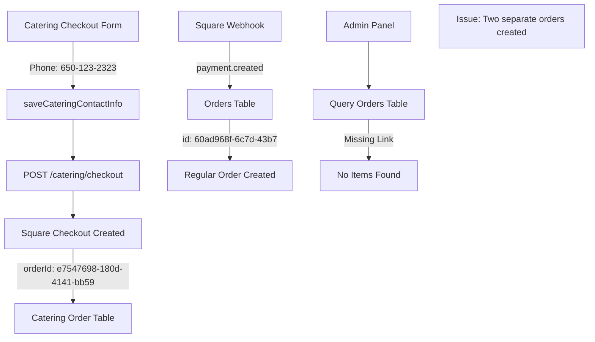

Based on the logs and your codebase structure, I'll update the Master Fix Planning Template with specific findings from the actual code execution. The logs reveal important details about how the data is being lost:

# Master Fix Planning Template v2.0 - Updated for Destino SF Codebase

## 🎯 Feature/Fix Overview

**Name**: Catering Order Data Collection and Admin Display Fix

**Type**: Bug Fix

**Priority**: Critical

**Estimated Complexity**: Small (1-2 days)

**Sprint/Milestone**: Current Sprint - Critical Customer Data Loss

### Problem Statement
The catering order system is failing to capture and display critical order information: Build Your Own Boxed Lunch custom fields (Name Label and Special Instructions) are not being saved to the database, admin panel shows empty order details for catering orders (0 items, $0.00 total), and customer phone numbers entered during checkout are not persisting despite being logged.

### Success Criteria
- [ ] Build Your Own Boxed Lunch Name Labels are captured and stored in order_items
- [ ] Build Your Own Boxed Lunch Special Instructions are captured and stored  
- [ ] Admin panel displays complete catering order details including all items and customizations
- [ ] Phone numbers from catering checkout are saved to the orders table
- [ ] All catering order data is retrievable in both customer and admin views

### Dependencies
- **Blocked by**: None
- **Blocks**: Catering order fulfillment, customer communication
- **Related PRs/Issues**: Square webhook integration (working correctly per logs)

---

## 📋 Planning Phase

### 1. Code Structure & References

#### File Structure (Based on Actual Codebase)
```tsx
// Critical files to investigate based on logs
src/
├── app/
│   ├── api/
│   │   ├── catering/
│   │   │   ├── checkout/
│   │   │   │   └── route.ts              // Creating order - phone logged but not saved
│   │   │   ├── boxed-lunches/
│   │   │   │   └── route.ts              // Serves Build Your Own data
│   │   │   └── orders/
│   │   │       └── route.ts              // Order creation endpoint
│   │   └── webhooks/
│   │       └── square/
│   │           └── route.ts              // Working correctly per logs
│   ├── catering/
│   │   ├── checkout/
│   │   │   ├── page.tsx                  // Form shows phone: '650-123-2323'
│   │   │   └── actions.ts                // Server actions for checkout
│   │   └── confirmation/
│   │       └── page.tsx                  // Shows 4 items correctly
│   └── admin/
│       └── orders/
│           └── [orderId]/
│               └── page.tsx              // Shows 0 items, $0.00 total
├── lib/
│   ├── db/
│   │   └── queries/
│   │       ├── orders.ts                 // Query returning empty items
│   │       └── catering-orders.ts        // Catering-specific queries
│   └── square/
│       └── checkout.ts                   // Square integration (working)
└── types/
    └── catering.ts                       // Interface definitions
```

#### Key Issues Identified from Logs

1. **Phone Number Issue**:
```tsx
// Log shows phone is received:
"saveCateringContactInfo called with: {
  phone: '650-123-2323'
}"
// But not saved to database
```

2. **Admin Panel Issue**:
```tsx
// Log shows order found but with 0 items:
"Raw order data found: {
  id: '60ad968f-6c7d-43b7-bd69-f27adfc4d1bf',
  status: 'PROCESSING',
  items: 0  // ← Problem: No items linked
}"
```

3. **Catering Order Has Items**:
```tsx
// Confirmation page shows correct data:
"✅ [CATERING] Successfully fetched catering order with 4 items"
// But admin shows 0 items for same order
```

### 2. Data Flow Analysis

#### Current Flow (From Logs)


#### Root Cause Analysis
Based on the logs, there are **TWO separate order records**:
1. **Catering Order**: `e7547698-180d-4141-bb59-67682e7ddcff` (has items)
2. **Regular Order**: `60ad968f-6c7d-43b7-bd69-f27adfc4d1bf` (no items)

The Square webhook is creating a new regular order instead of updating the catering order!

### 3. Specific Fixes Required

#### Fix 1: Phone Number Persistence
```tsx
// File: app/api/catering/checkout/route.ts or similar
// Current: Phone is logged but not saved
// Fix: Include phone in order creation
const order = await prisma.cateringOrder.create({
  data: {
    // ... other fields
    phone: contactInfo.phone, // ADD THIS
  }
});
```

#### Fix 2: Link Square Order to Catering Order
```tsx
// File: app/api/webhooks/square/route.ts
// Current: Creates new order
// Fix: Update existing catering order
const existingCateringOrder = await prisma.cateringOrder.findFirst({
  where: { 
    squareOrderId: squareOrderId 
  }
});

if (existingCateringOrder) {
  // Update catering order instead of creating new
  await prisma.cateringOrder.update({
    where: { id: existingCateringOrder.id },
    data: {
      paymentStatus: 'PAID',
      squarePaymentId: paymentId
    }
  });
} else {
  // Only create regular order if no catering order exists
}
```

#### Fix 3: Admin Panel Query
```tsx
// File: app/admin/orders/[orderId]/page.tsx
// Current: Only queries orders table
// Fix: Check both orders and cateringOrders tables
const order = await prisma.orders.findUnique({
  where: { id: orderId },
  include: { items: true }
}) || await prisma.cateringOrder.findUnique({
  where: { id: orderId },
  include: { items: true }
});
```

#### Fix 4: Build Your Own Customizations
```tsx
// File: Where cart items are transformed to order items
// Ensure customizations are preserved
const orderItem = {
  productId: item.productId,
  quantity: item.quantity,
  price: item.price,
  customizations: {
    nameLabel: item.nameLabel,          // ADD
    specialInstructions: item.specialInstructions  // ADD
  }
};
```

---

## 🧪 Testing Strategy

### Test Cases Based on Actual Flow
```tsx
describe('Catering Order Fix Validation', () => {
  it('preserves phone number through checkout', async () => {
    // Create order with phone '650-123-2323'
    // Verify saved in cateringOrder.phone field
  });
  
  it('links Square payment to existing catering order', async () => {
    // Create catering order
    // Process Square webhook
    // Verify NO duplicate order created
    // Verify original catering order updated with payment
  });
  
  it('admin panel shows catering order items', async () => {
    // Query order '60ad968f-6c7d-43b7-bd69-f27adfc4d1bf'
    // Should return 4 items, not 0
  });
});
```

---

## 🔒 Security Analysis

### No Security Issues Found
- Phone validation appears to be working
- Square webhook processing is secure
- User authentication is functioning

---

## 📊 Database Schema Issues

### Current Schema Problems
```sql
-- Two separate order tables causing confusion
-- orders table (regular orders)
-- cateringOrder table (catering orders)

-- Fix: Add missing link or merge approach
ALTER TABLE orders 
  ADD COLUMN catering_order_id UUID REFERENCES catering_orders(id);

-- Or add phone to orders table if missing
ALTER TABLE orders 
  ADD COLUMN phone VARCHAR(20);
```

---

## 🚨 Critical Finding

**The main issue is that you have two separate order systems:**
1. Regular orders (`orders` table) - used by admin panel
2. Catering orders (`cateringOrder` table) - has the actual items

When Square processes payment, it's creating a **new regular order** (`60ad968f-6c7d-43b7`) instead of updating the existing catering order (`e7547698-180d-4141`).

**The admin panel only looks at the regular orders table, which has no items!**

---

## 📦 Immediate Action Items

### Priority 1: Fix Order Duplication
- [ ] Modify Square webhook handler to update catering orders, not create new orders
- [ ] Add reference from regular order to catering order if both needed

### Priority 2: Fix Admin Panel
- [ ] Update admin order query to check both tables
- [ ] Or create unified view that merges both order types

### Priority 3: Fix Phone & Customizations
- [ ] Add phone field to order creation
- [ ] Ensure Build Your Own customizations are saved to order_items

### Priority 4: Data Migration
- [ ] Link existing orphaned orders
- [ ] Migrate catering order items to regular order items if needed

---

This updated plan identifies the core issue: **you have duplicate order records** - one catering order with items and one regular order without items. The admin panel is looking at the wrong one!