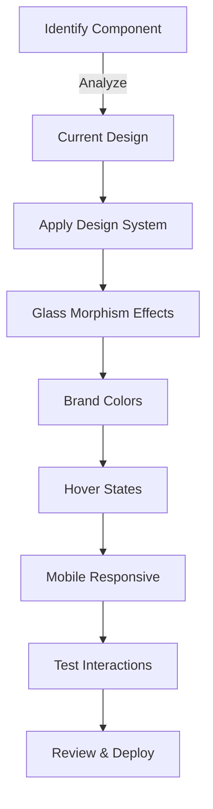

# Master Fix Planning Template v2.0
## Destino SF Design System Upgrade - Remaining UI Components

---

## 🎯 Feature/Fix Overview

**Name**: Destino SF Design System Implementation - Phase 2

**Type**: Enhancement | UI/UX Modernization

**Priority**: High

**Estimated Complexity**: Large (1+ week)

**Sprint/Milestone**: UI_MODERNIZATION_Q2_2025

### Problem Statement
Continue the modernization of Destino SF's food ordering platform by applying the established glass morphism design system to all remaining non-admin UI components. Multiple navigation, product, form, and catering components still use the old design patterns and need to be upgraded for consistency.

### Success Criteria
- [x] Cart, Checkout, and Account pages already modernized
- [ ] All navigation components use glass morphism effects
- [ ] Product pages and cards match the modern design
- [ ] Forms have consistent styling with brand colors
- [ ] Landing/home page components upgraded
- [ ] Catering pages follow the design system
- [ ] Authentication pages modernized
- [ ] Mobile responsiveness maintained throughout
- [ ] All hover states have proper text contrast

### Dependencies
- **Blocked by**: None
- **Blocks**: Final production deployment, Marketing campaign launch
- **Related PRs/Issues**: Phase 1 Cart/Checkout upgrade

---

## 📋 Planning Phase

### 1. Code Structure & References

#### File Structure - Components to Update
```tsx
src/
├── components/
│   ├── Navbar/              ⚠️ [PRIORITY 1]
│   │   └── index.tsx        // Main navigation - needs glass morphism
│   ├── Footer/              ⚠️ [PRIORITY 1]
│   │   └── index.tsx        // Footer - needs modern styling
│   ├── Landing/             ⚠️ [PRIORITY 2]
│   │   ├── index.tsx
│   │   └── components/
│   │       ├── HeroBanner.tsx     // Hero section upgrade
│   │       ├── PopularEmpanadas.tsx
│   │       └── MenuSection.tsx
│   ├── Products/            ⚠️ [PRIORITY 2]
│   │   ├── ProductCard.tsx        // Product cards modernization
│   │   ├── ProductDetails.tsx
│   │   ├── ProductGrid.tsx
│   │   └── ProductList.tsx
│   ├── ContactForm/         ⚠️ [PRIORITY 3]
│   │   ├── ContactForm.tsx        // Form styling
│   │   └── ContactCateringForm.tsx
│   ├── Marketing/           ⚠️ [PRIORITY 3]
│   │   ├── FeaturedProducts.tsx
│   │   ├── MarketingSection.tsx
│   │   └── ShopByCategory.tsx
│   ├── Catering/            ⚠️ [PRIORITY 4]
│   │   ├── CateringPackages.tsx
│   │   ├── CateringMenuTabs.tsx
│   │   └── [other catering components]
│   └── auth/                ⚠️ [PRIORITY 5]
│       ├── SignInForm.tsx
│       ├── ResetPasswordForm.tsx
│       └── SetupPasswordForm.tsx
├── app/
│   ├── (store)/
│   │   ├── menu/            ⚠️ [PRIORITY 2]
│   │   │   └── page.tsx     // Menu page layout
│   │   └── products/        ⚠️ [PRIORITY 2]
│   │       └── [slug]/page.tsx
│   ├── (auth)/              ⚠️ [PRIORITY 5]
│   │   ├── sign-in/page.tsx
│   │   └── sign-up/page.tsx
│   ├── catering/            ⚠️ [PRIORITY 4]
│   │   └── page.tsx
│   └── contact/             ⚠️ [PRIORITY 3]
│       └── page.tsx
```

#### Key Interfaces & Types
```tsx
// types/ui-upgrade.ts
export interface DesignSystemColors {
  primary: 'destino-yellow';      // #fdc32d
  secondary: 'destino-orange';    // #f77c22
  text: 'destino-charcoal';       // #2d3538
  background: 'destino-cream';    // #fcfcf5
}

export interface GlassMorphismClasses {
  container: 'bg-white/95 backdrop-blur-sm';
  card: 'bg-white/90 backdrop-blur-sm rounded-xl shadow-lg';
  button: 'transition-all duration-200 hover:scale-105';
  gradient: 'bg-gradient-to-br from-destino-cream via-white to-gray-50';
}

export interface ComponentUpgradeStatus {
  componentPath: string;
  status: 'pending' | 'in-progress' | 'completed' | 'reviewed';
  priority: 1 | 2 | 3 | 4 | 5;
  estimatedHours: number;
  assignee?: string;
}
```

#### Design System Constants
```tsx
// lib/design-system/constants.ts
export const DESIGN_TOKENS = {
  glassMorphism: {
    base: 'bg-white/95 backdrop-blur-sm',
    card: 'bg-white/90 backdrop-blur-sm rounded-xl shadow-lg',
    elevated: 'bg-white/95 backdrop-blur-md shadow-xl',
  },
  colors: {
    'destino-yellow': '#fdc32d',
    'destino-orange': '#f77c22',
    'destino-charcoal': '#2d3538',
    'destino-cream': '#fcfcf5',
  },
  transitions: {
    base: 'transition-all duration-200',
    hover: 'hover:scale-105 hover:shadow-xl',
  },
  spacing: {
    section: 'py-12 sm:py-16 lg:py-20',
    container: 'max-w-7xl mx-auto px-4 sm:px-6 lg:px-8',
  },
} as const;
```

### 2. Architecture Patterns

#### Component Upgrade Strategy


#### Design Implementation Pattern
```tsx
// Pattern for upgrading components
interface ComponentUpgradePattern {
  // 1. Container wrapper with gradient
  wrapper: `<div className="bg-gradient-to-br from-destino-cream via-white to-gray-50 min-h-screen">`;
  
  // 2. Glass morphism cards
  card: `<div className="bg-white/95 backdrop-blur-sm rounded-xl shadow-lg border border-destino-yellow/10">`;
  
  // 3. Button styling
  button: `<button className="bg-destino-yellow text-destino-charcoal hover:bg-destino-orange hover:text-white transition-all duration-200 hover:scale-105">`;
  
  // 4. Hover effects
  interactive: `<div className="transition-all duration-200 hover:scale-105 hover:shadow-xl">`;
}
```

### 3. Full Stack Integration Points

#### Component Categories & Priorities

##### Priority 1: Navigation & Layout (2 days)
```tsx
// Components to upgrade:
- Navbar/index.tsx
- Footer/index.tsx
- store/NavBar.tsx (if different from main)

// Key changes:
- Glass morphism sticky header
- Animated mobile menu with blur
- Footer with gradient transitions
- Cart icon with badge animation
```

##### Priority 2: Product Components (3 days)
```tsx
// Components to upgrade:
- Products/ProductCard.tsx
- Products/ProductGrid.tsx
- Products/ProductList.tsx
- Products/ProductDetails.tsx
- menu/page.tsx
- products/[slug]/page.tsx

// Key changes:
- Product cards with glass effect
- Hover animations on cards
- Price badges with brand colors
- Category tabs with gradients
```

##### Priority 3: Forms & Contact (2 days)
```tsx
// Components to upgrade:
- ContactForm/ContactForm.tsx
- ContactForm/ContactCateringForm.tsx
- contact/page.tsx
- Marketing components

// Key changes:
- Form inputs with glass backgrounds
- Submit buttons with brand colors
- Validation states with animations
- Contact info cards
```

##### Priority 4: Catering System (2 days)
```tsx
// Components to upgrade:
- All Catering/* components
- catering/page.tsx
- catering/checkout/page.tsx

// Key changes:
- Package cards with glass morphism
- Menu tabs with gradients
- Cart integration styling
- Dietary legend modernization
```

##### Priority 5: Authentication (1 day)
```tsx
// Components to upgrade:
- auth/SignInForm.tsx
- auth/ResetPasswordForm.tsx
- (auth)/sign-in/page.tsx
- (auth)/sign-up/page.tsx

// Key changes:
- Auth containers with blur
- Form inputs with modern styling
- Social login buttons
- Password strength indicators
```

---

## 🧪 Testing Strategy

### Visual Testing Checklist
```tsx
// Per-component testing requirements
interface VisualTestingChecklist {
  desktop: {
    glassEffect: boolean;
    brandColors: boolean;
    hoverStates: boolean;
    animations: boolean;
  };
  mobile: {
    responsive: boolean;
    touchTargets: boolean; // Min 44x44px
    menuDrawer: boolean;
    scrollPerformance: boolean;
  };
  accessibility: {
    contrast: boolean;      // WCAG AA minimum
    focusIndicators: boolean;
    keyboardNav: boolean;
    screenReader: boolean;
  };
}
```

### Browser Compatibility Testing
```yaml
browsers:
  - Chrome: latest, latest-1
  - Safari: latest, latest-1
  - Firefox: latest
  - Mobile Safari: iOS 14+
  - Chrome Mobile: Android 10+
```

### Performance Budget
```yaml
performance:
  cls: < 0.1           # Cumulative Layout Shift
  fid: < 100ms         # First Input Delay
  lcp: < 2.5s          # Largest Contentful Paint
  animations: 60fps     # Smooth animations
  blur-performance: GPU # Hardware acceleration
```

---

## 🔐 Security Analysis

### Security Considerations
- [ ] **CSS Injection**: Sanitize any dynamic class names
- [ ] **Image Security**: Use Next.js Image component exclusively
- [ ] **Form Security**: Maintain CSRF protection during styling
- [ ] **Content Security Policy**: Update CSP for backdrop-filter

---

## 📊 Performance & Monitoring

### Performance Optimizations
```tsx
// Optimize glass morphism for performance
const performanceOptimizations = {
  // Use will-change for animated elements
  animations: 'will-change-transform will-change-opacity',
  
  // Hardware acceleration
  gpu: 'transform: translateZ(0)',
  
  // Reduce blur on mobile for performance
  mobileBlur: 'sm:backdrop-blur-sm backdrop-blur-none',
  
  // Lazy load non-critical components
  lazyLoad: 'loading="lazy"',
};
```

### Monitoring Metrics
```tsx
// Track UI upgrade impact
interface UIMetrics {
  // User engagement
  bounceRate: number;
  avgSessionDuration: number;
  
  // Performance
  pageLoadTime: number;
  interactionLatency: number;
  
  // Conversion
  cartAdditionRate: number;
  checkoutCompletionRate: number;
}
```

---

## 🎨 UI/UX Considerations

### Design System Rules
1. **Glass Morphism**: Always use `bg-white/95 backdrop-blur-sm`
2. **Brand Colors**: Primary actions use `destino-yellow`, secondary use `destino-orange`
3. **Hover States**: All interactive elements need `hover:scale-105` and proper text contrast
4. **Gradients**: Background gradients use `from-destino-cream via-white to-gray-50`
5. **Shadows**: Cards use `shadow-lg`, elevated elements use `shadow-xl`
6. **Borders**: Subtle borders with `border-destino-yellow/10` or `/20`
7. **Transitions**: Always include `transition-all duration-200`

### Mobile-First Approach
```tsx
// Responsive design patterns
const responsivePatterns = {
  // Mobile-first spacing
  spacing: 'p-4 sm:p-6 lg:p-8',
  
  // Responsive text
  text: 'text-sm sm:text-base lg:text-lg',
  
  // Adaptive layouts
  grid: 'grid grid-cols-1 sm:grid-cols-2 lg:grid-cols-3',
  
  // Touch-friendly targets
  buttons: 'min-h-[44px] px-4 py-2',
};
```

### Common Pitfalls to Avoid
- ❌ White text on light hover backgrounds
- ❌ Missing mobile breakpoints
- ❌ Forgetting transition animations
- ❌ Inconsistent shadow depths
- ❌ Not testing blur performance on mobile

---

## 📦 Deployment & Rollback

### Pre-Deployment Checklist
- [ ] All components upgraded per priority list
- [ ] Visual regression tests pass
- [ ] Mobile responsiveness verified
- [ ] Hover states have proper contrast
- [ ] Performance metrics within budget
- [ ] Browser compatibility tested
- [ ] Accessibility audit complete
- [ ] Stakeholder review approved

### Rollback Strategy
```tsx
// Feature flag for gradual rollout
export const UI_UPGRADE_FLAGS = {
  navigation: process.env.NEXT_PUBLIC_NEW_NAV === 'true',
  products: process.env.NEXT_PUBLIC_NEW_PRODUCTS === 'true',
  forms: process.env.NEXT_PUBLIC_NEW_FORMS === 'true',
  catering: process.env.NEXT_PUBLIC_NEW_CATERING === 'true',
  auth: process.env.NEXT_PUBLIC_NEW_AUTH === 'true',
};
```

---

## 📝 Documentation Requirements

### Component Documentation Template
```markdown
## [Component Name] - Design System Upgrade

### Before
- Old styling approach
- Issues/inconsistencies

### After  
- Glass morphism applied
- Brand colors integrated
- Hover states fixed
- Mobile responsive

### Classes Applied
\`\`\`tsx
// Container
className="bg-white/95 backdrop-blur-sm rounded-xl"

// Buttons
className="bg-destino-yellow hover:bg-destino-orange hover:text-white"

// Cards
className="shadow-lg hover:shadow-xl transition-all duration-200"
\`\`\`

### Testing Notes
- Desktop: ✅
- Mobile: ✅  
- Accessibility: ✅
```

### Progress Tracking
```yaml
components:
  navigation:
    navbar: pending
    footer: pending
    mobile-menu: pending
  products:
    card: pending
    grid: pending
    details: pending
  forms:
    contact: pending
    catering-contact: pending
  catering:
    packages: pending
    menu-tabs: pending
    checkout: pending
  auth:
    sign-in: pending
    sign-up: pending
    reset-password: pending
```

---

## Implementation Roadmap

### Week 1
- Day 1-2: Navigation components (Navbar, Footer, Mobile menu)
- Day 3-5: Product components (Cards, Grid, Details, Menu page)

### Week 2  
- Day 6-7: Forms and Contact pages
- Day 8-9: Catering system components
- Day 10: Authentication pages and final polish

### Testing & Deployment
- Day 11: Full testing suite
- Day 12: Stakeholder review and adjustments
- Day 13: Production deployment

---

This master plan provides a systematic approach to completing the Destino SF design system upgrade, ensuring consistency across all user-facing components while maintaining the established glass morphism aesthetic and brand identity.