# 🚨 URGENT FIX PLAN: Square Orders Stuck in DRAFT State

## 🔴 Critical Issue Overview

**Name**: Square Orders Not Appearing in Dashboard

**Type**: Bug Fix

**Priority**: CRITICAL

**Estimated Complexity**: Small (1-2 hours)

**Sprint/Milestone**: HOTFIX-2025-01

### Problem Statement
Orders are successfully created in Square but remain in DRAFT state, making them invisible in Square's order overview. The payment flow is incomplete - orders are never finalized after payment processing.

### Success Criteria
- [x] Orders appear in Square's order overview after payment
- [x] Orders transition from DRAFT → OPEN → COMPLETED states
- [x] No duplicate or phantom orders created
- [x] Payment webhooks properly finalize orders

### Dependencies
- **Blocked by**: None
- **Blocks**: Customer order visibility in Square
- **Related Files**: 
  - `/src/lib/square/orders.ts`
  - `/src/lib/square/service.ts`
  - `/src/app/api/checkout/payment/route.ts`
  - `/src/app/api/webhooks/square/route.ts`

---

## 🔍 Root Cause Analysis

### Current Flow (BROKEN)

```mermaid
graph TD
    A[Checkout Initiated] -->|Creates Order| B[Square Order Created - DRAFT]
    B --> C[Payment Processed]
    C --> D[Payment Webhook Received]
    D --> E[Order Status Updated in DB]
    E --> X[❌ Square Order Stays DRAFT]
    X --> Y[Order Invisible in Square]
```


### Expected Flow (FIXED)

```mermaid
graph TD
    A[Checkout Initiated] -->|Creates Order| B[Square Order Created - DRAFT]
    B --> C[Payment Processed with Order ID]
    C --> D[Square Auto-Updates Order to OPEN]
    D --> E[Payment Webhook Updates DB]
    E --> F[✅ Order Visible in Square]
```


---

## 🔧 Implementation Fix

### File 1: Fix Payment Processing (`/src/lib/square/orders.ts`)

```typescript
// CURRENT CODE (BROKEN)
export async function createPayment(sourceId: string, orderId: string, amountCents: number) {
  // ... existing code ...
  const paymentRequest = {
    sourceId: sourceId,
    orderId: orderId,  // ← This is missing autocomplete!
    idempotencyKey: randomUUID(),
    amountMoney: {
      amount: BigInt(amountCents),
      currency: 'USD',
    },
  };
  // ... rest of code ...
}

// FIXED CODE
export async function createPayment(sourceId: string, orderId: string, amountCents: number) {
  try {
    logger.info('Creating Square payment', { orderId, amountCents });

    const squareService = getSquareService();

    // CRITICAL FIX: Add autocomplete to finalize the order
    const paymentRequest = {
      sourceId: sourceId,
      idempotencyKey: randomUUID(),
      amountMoney: {
        amount: BigInt(amountCents),
        currency: 'USD',
      },
      // CRITICAL: These fields link payment to order AND trigger auto-completion
      orderId: orderId,
      autocomplete: true,  // ← THIS IS THE KEY FIX!
    };

    const result = await squareService.createPayment(paymentRequest);

    if (!result.payment) {
      throw new Error('Failed to create payment or payment data is missing in the response.');
    }

    logger.info('Successfully created Square payment and finalized order', { 
      paymentId: result.payment.id,
      orderStatus: result.payment.order?.state // Should now be OPEN/COMPLETED
    });
    
    return result.payment;
  } catch (error) {
    logger.error('Error processing payment:', error);
    if (error instanceof Error && 'body' in error) {
      logger.error('Square API Error Body:', (error as { body: unknown }).body);
    }
    throw error;
  }
}
```

### File 2: Alternative Fix - Update Order After Payment (`/src/app/api/checkout/payment/route.ts`)

If the autocomplete flag doesn't work, add this fallback:

```typescript
// Add this after successful payment creation
export async function POST(request: Request) {
  // ... existing code ...
  
  try {
    // ... existing payment processing ...
    
    // Process payment with Square
    const payment = await createPayment(sourceId, order.squareOrderId, amount);

    // NEW: Ensure order is finalized in Square
    if (payment.status === 'COMPLETED' || payment.status === 'APPROVED') {
      // Update order state in Square to OPEN (makes it visible)
      await finalizeSquareOrder(order.squareOrderId);
    }

    // ... rest of existing code ...
  } catch (error) {
    // ... error handling ...
  }
}

// NEW HELPER FUNCTION
async function finalizeSquareOrder(squareOrderId: string): Promise<void> {
  try {
    const squareService = getSquareService();
    
    // Update order to OPEN state
    const updateRequest = {
      order: {
        locationId: process.env.SQUARE_LOCATION_ID!,
        state: 'OPEN',
        version: undefined, // Let Square handle versioning
      },
      fieldsToClear: [],
      idempotencyKey: randomUUID(),
    };
    
    await squareService.updateOrder(squareOrderId, updateRequest);
    console.log(`✅ Square order ${squareOrderId} finalized and visible`);
  } catch (error) {
    console.error(`Failed to finalize Square order ${squareOrderId}:`, error);
    // Don't throw - payment succeeded, this is a secondary operation
  }
}
```

### File 3: Add Update Order Method (`/src/lib/square/service.ts`)

```typescript
// Add this method to the SquareService class
async updateOrder(orderId: string, updateData: any): Promise<any> {
  this.ensureClient();

  try {
    logger.debug('SquareService - Updating order', { orderId, updateData });
    const response = await this.client.ordersApi.updateOrder(orderId, updateData);
    return response.result;
  } catch (error) {
    logger.error('SquareService - Error updating order:', error);
    throw error;
  }
}
```

---

## 🧪 Testing Strategy

### 1. Quick Manual Test
```bash
# Test in development
1. Create a test order
2. Process payment with test card
3. Check Square Dashboard - order should appear immediately
4. Verify order state is OPEN or COMPLETED, not DRAFT
```

### 2. Unit Test for Payment Creation
```typescript
// __tests__/lib/square/orders.test.ts
describe('createPayment', () => {
  it('should include autocomplete flag for order finalization', async () => {
    const mockSquareService = {
      createPayment: jest.fn().mockResolvedValue({
        payment: { 
          id: 'test-payment',
          order: { state: 'OPEN' } // Order should be OPEN after payment
        }
      })
    };
    
    await createPayment('test-source', 'test-order', 10000);
    
    expect(mockSquareService.createPayment).toHaveBeenCalledWith(
      expect.objectContaining({
        autocomplete: true,
        orderId: 'test-order'
      })
    );
  });
});
```

### 3. Integration Test
```typescript
// Test the full flow
it('should make orders visible in Square after payment', async () => {
  // 1. Create order
  const order = await createOrder(testOrderData);
  expect(order.state).toBe('DRAFT');
  
  // 2. Process payment
  const payment = await createPayment(testSourceId, order.id, 10000);
  
  // 3. Verify order is now visible
  const updatedOrder = await getOrder(order.id);
  expect(updatedOrder.state).toBe('OPEN'); // Or COMPLETED
});
```

---

## 🚀 Deployment Plan

### Immediate Hotfix Steps

1. **Apply Fix** (5 minutes)
   ```bash
   # Update orders.ts with autocomplete flag
   git checkout -b hotfix/square-order-visibility
   # Apply changes to orders.ts
   git add src/lib/square/orders.ts
   git commit -m "fix: Add autocomplete flag to finalize Square orders"
   ```

2. **Test Locally** (10 minutes)
   ```bash
   npm run dev
   # Create test order and verify it appears in Square
   ```

3. **Deploy to Staging** (5 minutes)
   ```bash
   git push origin hotfix/square-order-visibility
   # Deploy to staging environment
   vercel --env preview
   ```

4. **Verify Fix** (10 minutes)
   - Create order in staging
   - Check Square Dashboard
   - Confirm order is visible

5. **Deploy to Production** (5 minutes)
   ```bash
   # Merge to main
   git checkout main
   git merge hotfix/square-order-visibility
   git push origin main
   
   # Production deploy
   vercel --prod
   ```

---

## 📊 Monitoring & Verification

### Post-Deployment Checks

```sql
-- Check recent orders for proper Square state
SELECT 
  id,
  square_order_id,
  status,
  payment_status,
  created_at
FROM orders
WHERE created_at > NOW() - INTERVAL '1 hour'
ORDER BY created_at DESC;
```

### Square Dashboard Verification
1. Log into Square Dashboard
2. Navigate to Orders
3. Confirm new orders appear immediately after payment
4. Verify order states are OPEN/COMPLETED, not DRAFT

### Alert Setup
```typescript
// Add monitoring for draft orders
if (order.state === 'DRAFT' && payment.status === 'COMPLETED') {
  logger.error('CRITICAL: Order stuck in DRAFT after payment', {
    orderId: order.id,
    paymentId: payment.id
  });
  // Send alert to team
}
```

---

## ⚠️ Risk Mitigation

### Potential Issues & Solutions

1. **Autocomplete flag not supported**
   - Use the updateOrder fallback method
   - Manually transition order to OPEN state

2. **Version conflicts in Square**
   - Don't specify version in update request
   - Let Square handle optimistic locking

3. **Rate limiting**
   - Implement exponential backoff
   - Cache order state to reduce API calls

---

## ✅ Validation Checklist

- [ ] Orders appear in Square Dashboard immediately after payment
- [ ] No DRAFT orders with completed payments
- [ ] Existing order flow still works
- [ ] No duplicate orders created
- [ ] Webhook processing handles finalized orders correctly
- [ ] Customer receives order confirmation
- [ ] Square reports show accurate order data

---

## 📝 Long-term Improvements

After the hotfix, consider:

1. **Add Order State Machine**
   ```typescript
   class OrderStateMachine {
     transitions = {
       DRAFT: ['OPEN', 'CANCELLED'],
       OPEN: ['COMPLETED', 'CANCELLED'],
       COMPLETED: ['REFUNDED'],
     };
   }
   ```

2. **Implement Retry Logic**
   ```typescript
   async function ensureOrderFinalized(orderId: string, maxRetries = 3) {
     // Retry logic with exponential backoff
   }
   ```

3. **Add Comprehensive Logging**
   ```typescript
   logger.info('Order state transition', {
     orderId,
     from: previousState,
     to: newState,
     trigger: 'payment_completed'
   });
   ```

---

## 🎯 Success Metrics

- **Immediate**: 100% of paid orders visible in Square
- **24 hours**: Zero DRAFT orders with completed payments
- **1 week**: Customer support tickets about missing orders = 0

---

This fix should be deployed **IMMEDIATELY** to resolve the critical issue of orders not appearing in Square's dashboard.