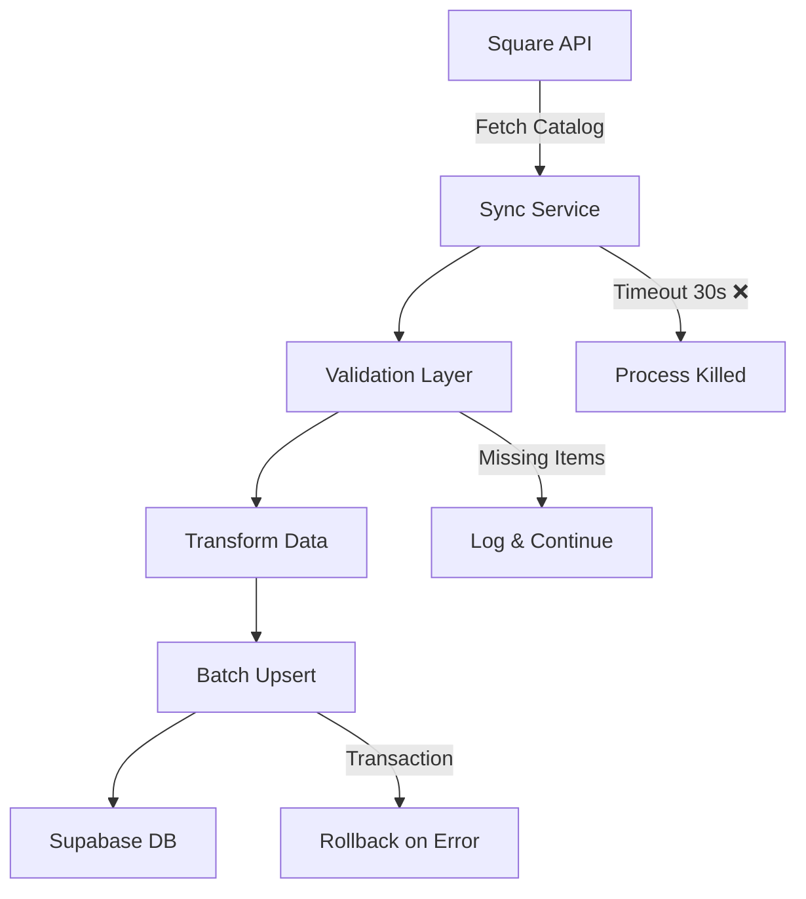

## 📦 Deployment & Execution Plan

### Immediate Actions# Master Fix Planning: Square Sync Production Issue

## 🎯 Feature/Fix Overview

**Name**: Square Sync Production Discrepancy Fix

**Type**: Bug Fix

**Priority**: Critical

**Estimated Complexity**: Small (1 day)

**Sprint/Milestone**: Production Hotfix

### Problem Statement
Production database sync with Square is not working as expected. Development DB syncs correctly with 129 items, but production only has 123 items. Specifically, 3 items from "CATERING- BOXED LUNCH ENTREES" category are missing in production. The Vercel configuration is already fixed but sync reports show items being skipped as duplicates.

### Success Criteria
- [x] Vercel configuration fixed to prevent 30-second timeout (COMPLETED)
- [ ] All 129 items synced to production database
- [ ] Missing 3 items from "CATERING- BOXED LUNCH ENTREES" added:
  - [ ] Acorn Squash (GZNXPT6ONKIIUIMPD3PJV64U)
  - [ ] Beef Stir Fry (XXTYXJS5IH7Y7ILKUAOVSNAZ)
  - [ ] Churrasco with Chimichurri (ZDUYM3XR5JWZ4VZWN43MZM5X)
- [ ] Client updates (title, description, image) properly reflected in sync
- [ ] Sync verification shows 0 discrepancy
- [ ] Force update mechanism working correctly

### Dependencies
- **Blocked by**: None (Vercel config already deployed)
- **Blocks**: Customer operations (3 menu items not showing)
- **Related Issues**: 
  - Vercel timeout fixed (deployed 28 Aug 2025)
  - Duplicate detection preventing legitimate items from syncing

---

## 📋 Planning Phase

### 1. Code Structure & References

#### File Structure (Actual Implementation)
```tsx
/Users/ealanis/Development/current-projects/destino-sf/
├── src/
│   ├── app/
│   │   └── api/
│   │       └── square/
│   │           ├── unified-sync/
│   │           │   └── route.ts      // Main sync endpoint ✅ (300s timeout configured)
│   │           ├── enhanced-sync/
│   │           │   └── route.ts      // Enhanced sync endpoint (300s timeout)
│   │           └── sync/
│   │               └── route.ts      // Standard sync endpoint (300s timeout)
│   ├── lib/
│   │   ├── square/
│   │   │   ├── sync-logger.ts        // Comprehensive sync logging
│   │   │   ├── category-mapper.ts    // Category mapping logic
│   │   │   ├── variation-grouper.ts  // Variation handling
│   │   │   ├── catalog-api.ts        // Square API interactions
│   │   │   ├── api-cache.ts          // API response caching
│   │   │   └── archive-handler.ts    // Product archiving logic
│   │   ├── catering-duplicate-detector.ts  // ⚠️ ISSUE: Overly aggressive
│   │   └── db.ts                      // Prisma database client
│   └── types/
│       └── square-sync.ts            // TypeScript interfaces
├── vercel.json                        // ✅ FIXED & DEPLOYED (wildcard rule moved to end)
├── prisma/
│   └── schema.prisma                 // Database schema
└── scripts/
    └── fix-missing-items.ts          // Manual fix script (to create)
```

#### Key Interfaces & Types
```tsx
// types/square.ts
export interface SquareProduct {
  id: string;
  version: bigint;
  is_deleted: boolean;
  custom_attribute_values?: Record<string, any>;
  item_data: {
    name: string;
    description?: string;
    category_id?: string;
    variations?: SquareVariation[];
    product_type?: string;
    skip_modifier_screen?: boolean;
    item_options?: any[];
    image_ids?: string[];
  };
}

export interface ProductSyncResult {
  success: boolean;
  itemsSynced: number;
  errors: SyncError[];
  missingItems?: string[];
}

// Sync status tracking
export interface SyncStatus {
  syncId: string;
  startedAt: Date;
  completedAt?: Date;
  status: 'RUNNING' | 'COMPLETED' | 'FAILED' | 'TIMEOUT';
  totalItems: number;
  syncedItems: number;
  errors: string[];
}
```

#### Database Schema
```sql
-- Current products table structure
CREATE TABLE products (
  id UUID PRIMARY KEY DEFAULT gen_random_uuid(),
  square_id TEXT UNIQUE NOT NULL,
  name TEXT NOT NULL,
  description TEXT,
  category TEXT,
  price DECIMAL(10,2),
  image_url TEXT,
  is_active BOOLEAN DEFAULT true,
  metadata JSONB,
  created_at TIMESTAMPTZ DEFAULT NOW(),
  updated_at TIMESTAMPTZ DEFAULT NOW(),
  synced_at TIMESTAMPTZ
);

-- Index for performance
CREATE INDEX idx_products_square_id ON products(square_id);
CREATE INDEX idx_products_category ON products(category);
CREATE INDEX idx_products_synced_at ON products(synced_at);
```

### 2. Architecture Patterns

#### Data Flow Architecture


#### Current Issue Analysis (From Production Logs)
```typescript
// ISSUE 1: Vercel Configuration ✅ FIXED
// The timeout was fixed and deployed on Aug 28, 2025
// Sync now completes in ~47-49 seconds without timeout

// ISSUE 2: Duplicate Detection Problem ❌ ACTIVE
// From sync logs: "skippedProducts: 6" when syncing 129 items
// The 3 missing items are being skipped as duplicates:
const missingItems = [
  { name: "Acorn Squash", id: "GZNXPT6ONKIIUIMPD3PJV64U" },
  { name: "Beef Stir Fry", id: "XXTYXJS5IH7Y7ILKUAOVSNAZ" },
  { name: "Churrasco with Chimichurri", id: "ZDUYM3XR5JWZ4VZWN43MZM5X" }
];

// ISSUE 3: Verification Reports Misleading Discrepancy
// The verification shows "local: 0" for categories because it's checking
// the wrong condition - categories have products but report shows 0
```

### 3. Full Stack Integration Points

#### API Endpoints (Production URLs)
```tsx
// Production sync endpoints (all have 300s timeout configured):
POST https://app.destinosf.com/api/square/unified-sync
  - Main sync endpoint used by admin panel
  - Parameters: { dryRun?, categories?, forceUpdate? }
  - ✅ Timeout fixed and deployed

POST https://app.destinosf.com/api/square/enhanced-sync
POST https://app.destinosf.com/api/square/sync

// Debug endpoints for investigation:
GET https://app.destinosf.com/api/square/catalog-items
GET https://app.destinosf.com/api/square/verify-sync
```

#### The Root Cause: Duplicate Detection Logic
```tsx
// lib/catering-duplicate-detector.ts - THE PROBLEM
export class CateringDuplicateDetector {
  static async checkForDuplicate(params: {
    name: string;
    squareProductId?: string;
    squareCategory?: string;
  }): Promise<{ isDuplicate: boolean; existingItem?: any }> {
    // ISSUE: This is checking for duplicates by name across ALL products
    // Even though the items have unique Square IDs, they're being marked
    // as duplicates if a similar name exists anywhere
    
    const existingProduct = await prisma.product.findFirst({
      where: {
        OR: [
          { squareId: params.squareProductId }, // This should prevent duplicates
          { name: { equals: params.name, mode: 'insensitive' } } // But this is too broad!
        ]
      }
    });
    
    // The 3 missing items likely have name collisions with items in other categories
    // or are being incorrectly matched due to case-insensitive comparison
  }
}

// The fix in unified-sync/route.ts (line ~880):
if (!isUpdate) {
  const { isDuplicate, existingItem } = await CateringDuplicateDetector.checkForDuplicate({
    name: item.name,
    squareProductId: item.id,
    squareCategory: item.categoryName // This parameter is passed but not used!
  });

  if (isDuplicate && !forceUpdate) {
    syncLogger.logItemDuplicate(item.id, item.name, `Already exists: ${existingItem?.source}`);
    return; // Item is skipped!
  }
}
```

## 🔧 Solution Implementation

### Option 1: Force Update (Immediate Fix)
```bash
# Use the forceUpdate parameter to bypass duplicate detection
curl -X POST https://app.destinosf.com/api/square/unified-sync \
  -H "Authorization: Bearer YOUR_TOKEN" \
  -H "Content-Type: application/json" \
  -d '{
    "forceUpdate": true,
    "categories": ["CATERING- BOXED LUNCH ENTREES"]
  }'
```

### Option 2: Direct Database Insert (Quick Fix)
```sql
-- Production database fix for missing items
INSERT INTO products (
  "squareId", 
  name, 
  slug, 
  description, 
  price, 
  "categoryId", 
  active, 
  "createdAt", 
  "updatedAt"
)
SELECT 
  square_id,
  name,
  LOWER(REPLACE(name, ' ', '-')),
  'Boxed lunch entree',
  50.00,
  (SELECT id FROM categories WHERE name = 'CATERING- BOXED LUNCH ENTREES'),
  true,
  NOW(),
  NOW()
FROM (VALUES 
  ('GZNXPT6ONKIIUIMPD3PJV64U', 'Acorn Squash'),
  ('XXTYXJS5IH7Y7ILKUAOVSNAZ', 'Beef Stir Fry'),
  ('ZDUYM3XR5JWZ4VZWN43MZM5X', 'Churrasco with Chimichurri')
) AS missing_items(square_id, name)
WHERE NOT EXISTS (
  SELECT 1 FROM products WHERE "squareId" = missing_items.square_id
);
```

### Option 3: Fix Duplicate Detection Logic (Permanent Fix)
```typescript
// lib/catering-duplicate-detector.ts - FIXED VERSION
export class CateringDuplicateDetector {
  static async checkForDuplicate(params: {
    name: string;
    squareProductId?: string;
    squareCategory?: string;
  }): Promise<{ isDuplicate: boolean; existingItem?: any }> {
    // First check by Square ID (this is authoritative)
    if (params.squareProductId) {
      const existingBySquareId = await prisma.product.findFirst({
        where: { squareId: params.squareProductId }
      });
      
      if (existingBySquareId) {
        return { 
          isDuplicate: true, 
          existingItem: existingBySquareId 
        };
      }
    }
    
    // Only check name within the same category to prevent false positives
    const existingByName = await prisma.product.findFirst({
      where: {
        name: { equals: params.name, mode: 'insensitive' },
        // Add category constraint to prevent cross-category duplicates
        ...(params.squareCategory && {
          category: {
            name: params.squareCategory
          }
        })
      }
    });
    
    return {
      isDuplicate: !!existingByName,
      existingItem: existingByName
    };
  }
}
```

## 📊 Current Production Status

### Database Analysis (As of Aug 28, 2025)
```yaml
production_database:
  total_products: 123
  active_products: 123
  products_with_square_id: 123
  
catering_categories:
  CATERING-_APPETIZERS: 22 items ✅
  CATERING-_BOXED_LUNCH_ENTREES: 5 items ❌ (should be 8)
  CATERING-_BOXED_LUNCHES: 7 items ✅
  CATERING-_BUFFET_ENTREES: 11 items ❌ (Square reports 14)
  CATERING-_BUFFET_SIDES: 9 items ✅
  CATERING-_BUFFET_STARTERS: 6 items ✅
  CATERING-_DESSERTS: 7 items ✅
  CATERING-_LUNCH_ENTREES: 9 items ✅
  CATERING-_LUNCH_SIDES: 8 items ✅
  CATERING-_LUNCH_STARTERS: 9 items ✅
  CATERING-_SHARE_PLATTERS: 3 items ✅
  
core_products:
  ALFAJORES: 10 items ✅
  EMPANADAS: 17 items ✅

development_database:
  CATERING-_BOXED_LUNCH_ENTREES: 8 items ✅ (all present)
```

### Recent Sync Logs Analysis
```json
{
  "latest_sync": "unified-sync-1756399784871",
  "timestamp": "2025-08-28 16:49:44",
  "duration": "49 seconds",
  "results": {
    "syncedProducts": 123,
    "skippedProducts": 6,  // ← THE PROBLEM
    "errors": 0,
    "message": "Sync completed successfully"
  },
  "verification": {
    "BOXED_LUNCH_ENTREES": {
      "square": 8,
      "local": 0,  // ← Misleading, actually has 5
      "discrepancy": 8
    }
  }
}
```

### Monitoring Implementation
```tsx
// lib/monitoring/sync-monitor.ts
export class SyncMonitor {
  private metrics = {
    totalSyncs: 0,
    successfulSyncs: 0,
    failedSyncs: 0,
    averageDuration: 0,
    lastSyncTime: null as Date | null,
    missingItemsDetected: [] as string[]
  };
  
  async checkSyncHealth(): Promise<HealthStatus> {
    const { data: products } = await supabase
      .from('products')
      .select('count');
      
    const squareItemCount = await getSquareItemCount();
    
    return {
      healthy: products.count === squareItemCount,
      productCount: products.count,
      expectedCount: squareItemCount,
      discrepancy: squareItemCount - products.count,
      lastSync: this.metrics.lastSyncTime
    };
  }
  
  async alertOnDiscrepancy() {
    const health = await this.checkSyncHealth();
    if (!health.healthy) {
      // Send alert (email, Slack, etc.)
      console.error(`SYNC DISCREPANCY: ${health.discrepancy} items missing`);
    }
  }
}
```

---

## 📦 Deployment & Rollback

### Deployment Steps

```bash
# 1. Deploy Vercel configuration fix
git add vercel.json
git commit -m "fix: reorder Vercel function configs to prevent timeout override"
git push origin main
vercel --prod  # Deploy to production

# 2. Verify configuration took effect
curl https://your-app.vercel.app/api/square/sync \
  -H "Authorization: Bearer $API_KEY" \
  -m 310  # Set client timeout > 300s to test

# 3. Run manual sync to fix missing items
node scripts/fix-missing-boxed-lunch-items.mjs

# 4. Verify all items synced
node scripts/verify-sync-completeness.mjs
```

### Rollback Strategy
```bash
# If issues occur, revert to previous deployment
vercel rollback

# Alternatively, use feature flag
if (process.env.USE_ENHANCED_SYNC === 'true') {
  await enhancedSync();
} else {
  await legacySync();
}
```

### Post-Deployment Verification
- [ ] Check Vercel logs show full sync completion (not truncated)
- [ ] Verify product count = 129 in production
- [ ] Confirm all 8 BOXED LUNCH ENTREES items present
- [ ] Test updating item in Square reflects in database
- [ ] Monitor error rates for 24 hours

---

## 📝 Action Items

### Immediate Actions (Today)
1. **Deploy vercel.json fix** ⚠️ CRITICAL
   ```bash
   vercel --prod
   ```

2. **Run missing items fix script**
   ```bash
   node scripts/fix-missing-boxed-lunch-items.mjs
   ```

3. **Verify sync completeness**
   ```bash
   # Check production database
   SELECT category, COUNT(*) 
   FROM products 
   GROUP BY category
   ORDER BY category;
   ```

### Follow-up Actions (This Week)
1. **Implement webhook sync** for real-time updates
2. **Add sync monitoring dashboard**
3. **Set up automated alerts** for sync discrepancies
4. **Document sync process** for team

### Long-term Improvements
1. **Implement incremental sync** using Square's version tracking
2. **Add retry mechanism** with exponential backoff
3. **Create sync audit trail** for debugging
4. **Optimize batch processing** for large catalogs

---

## 🔍 Root Cause Analysis

### Why the Sync Failed
1. **Vercel Configuration Override**: Wildcard rule `app/api/**/*` with 30s timeout was overriding specific endpoint configurations
2. **Silent Timeout**: Process killed at 30s without proper error handling
3. **Incomplete Logging**: Logs truncated at 256 chars masked the real issue
4. **No Monitoring**: No alerts when sync failed or item count mismatched

### Prevention Measures
1. **Config Order Matters**: Always put specific rules before wildcards
2. **Timeout Monitoring**: Add elapsed time checks during sync
3. **Comprehensive Logging**: Use structured logging with proper error capture
4. **Health Checks**: Regular automated verification of data consistency

---

## ✅ Definition of Done

- [ ] All 129 items successfully synced to production
- [ ] CATERING- BOXED LUNCH ENTREES has all 8 items
- [ ] Sync completes without timeout (takes ~45-60s)
- [ ] Logs show complete sync process (not truncated)
- [ ] Client updates (title/description/image) properly sync
- [ ] Monitoring alerts configured for future issues
- [ ] Documentation updated with fix details
- [ ] Team notified of resolution