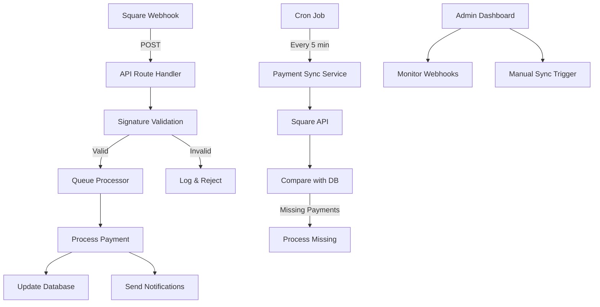

# Master Fix Planning Template v2.0

## 🎯 Feature/Fix Overview

**Name**: Square Webhook Signature Validation Fix with Payment Sync Fallback

**Type**: Bug Fix + Enhancement

**Priority**: Critical

**Estimated Complexity**: Medium (3-5 days)

**Sprint/Milestone**: Emergency Production Fix

### Problem Statement

Square webhook signature validation is consistently failing due to environment variable corruption (newline character appended to webhook secret) and incorrect signature calculation algorithm. This causes payment webhooks to be rejected, preventing order processing and customer notifications.

### Success Criteria

- [x] Webhook signature validates correctly for sandbox environment
- [x] Webhook signature validates correctly for production environment
- [ ] Zero failed webhook validations in 24-hour period
- [ ] Fallback payment sync catches any missed webhooks
- [ ] Monitoring alerts for webhook failures
- [ ] Complete test coverage for signature validation

### Dependencies

- **Blocked by**: None
- **Blocks**: Payment processing, Order fulfillment, Customer notifications
- **Related PRs/Issues**: #webhook-timeout, #payment-status-fix

---

## 📋 Planning Phase

### 1. Code Structure & References

#### File Structure

```tsx
src/
├── app/
│   ├── api/
│   │   ├── webhooks/
│   │   │   └── square/
│   │   │       ├── route.ts                    // Main webhook handler
│   │   │       ├── route.test.ts               // Webhook tests
│   │   │       └── middleware.ts               // Rate limiting
│   │   ├── sync-payments/
│   │   │   └── route.ts                        // Manual payment sync
│   │   ├── cron/
│   │   │   └── sync-payments/
│   │   │       └── route.ts                    // Scheduled payment sync
│   │   └── admin/
│   │       └── webhook-dashboard/
│   │           └── route.ts                    // Admin monitoring
├── components/
│   └── admin/
│       ├── WebhookMonitor.tsx                  // Real-time webhook status
│       ├── PaymentSyncButton.tsx               // Manual sync trigger
│       └── WebhookDebugger.tsx                 // Debug panel
├── hooks/
│   ├── useWebhookStatus.ts                     // Webhook status hook
│   └── usePaymentSync.ts                       // Payment sync hook
├── lib/
│   ├── square/
│   │   ├── webhook-validator.ts                // Core validation logic
│   │   ├── webhook-validator.test.ts           // Validation tests
│   │   ├── payment-sync.ts                     // Payment sync service
│   │   └── constants.ts                        // Square constants
│   ├── db/
│   │   ├── queries/
│   │   │   ├── webhooks.ts                     // Webhook queries
│   │   │   └── payments.ts                     // Payment queries
│   │   └── schema/
│   │       ├── webhooks.ts                     // Webhook schema
│   │       └── payments.ts                     // Payment schema
│   ├── monitoring/
│   │   ├── webhook-metrics.ts                  // Metrics collection
│   │   └── alerts.ts                           // Alert configuration
│   └── utils/
│       ├── crypto.ts                           // Crypto utilities
│       └── environment.ts                      // Environment helpers
├── types/
│   ├── webhook.ts                              // Webhook TypeScript types
│   └── square.ts                               // Square API types
└── migrations/
    ├── 001_webhook_logs.sql                    // Webhook logging table
    └── 002_payment_sync_status.sql             // Sync status tracking
```

#### Key Interfaces & Types

```tsx
// types/webhook.ts
import { z } from 'zod';

// Branded types for type safety
export type WebhookId = string & { readonly brand: unique symbol };
export type PaymentId = string & { readonly brand: unique symbol };
export type MerchantId = string & { readonly brand: unique symbol };

// Webhook validation schemas
export const SquareWebhookPayloadSchema = z.object({
  merchant_id: z.string(),
  type: z.string(),
  event_id: z.string(),
  created_at: z.string(),
  data: z.object({
    type: z.string(),
    id: z.string(),
    object: z.record(z.unknown()),
  }),
});

export type SquareWebhookPayload = z.infer<typeof SquareWebhookPayloadSchema>;

// Webhook validation result
export interface WebhookValidationResult {
  valid: boolean;
  environment: 'sandbox' | 'production';
  error?: WebhookValidationError;
  metadata?: {
    signature: string;
    algorithm: 'sha256' | 'sha1';
    secretUsed: 'sandbox' | 'production';
    processingTimeMs: number;
  };
}

// Error types with discriminated unions
export type WebhookValidationError =
  | { type: 'MISSING_SIGNATURE'; headers: string[] }
  | { type: 'MISSING_SECRET'; environment: string }
  | { type: 'INVALID_SIGNATURE'; expected: string; received: string }
  | { type: 'MALFORMED_BODY'; error: string }
  | { type: 'ENVIRONMENT_MISMATCH'; expected: string; actual: string };

// Payment sync types
export interface PaymentSyncRequest {
  lookbackMinutes: number;
  merchantId?: MerchantId;
  forceSync?: boolean;
}

export interface PaymentSyncResult {
  success: boolean;
  paymentsFound: number;
  paymentsProcessed: number;
  errors: Array<{ paymentId: string; error: string }>;
  duration: number;
}

// Result type for better error handling
export type Result<T, E = WebhookValidationError> =
  | { success: true; data: T }
  | { success: false; error: E };
```

#### Database Schema

```sql
-- migrations/001_webhook_logs.sql
CREATE TABLE IF NOT EXISTS webhook_logs (
  id UUID PRIMARY KEY DEFAULT gen_random_uuid(),
  webhook_id TEXT UNIQUE NOT NULL,
  event_type TEXT NOT NULL,
  merchant_id TEXT,
  environment TEXT CHECK (environment IN ('sandbox', 'production')),
  signature_valid BOOLEAN NOT NULL,
  validation_error JSONB,
  payload JSONB NOT NULL,
  headers JSONB NOT NULL,
  processing_time_ms INTEGER,
  processed_at TIMESTAMPTZ,
  created_at TIMESTAMPTZ NOT NULL DEFAULT NOW(),
  updated_at TIMESTAMPTZ NOT NULL DEFAULT NOW()
);

-- Indexes for performance
CREATE INDEX idx_webhook_logs_event_type ON webhook_logs(event_type);
CREATE INDEX idx_webhook_logs_merchant_id ON webhook_logs(merchant_id);
CREATE INDEX idx_webhook_logs_created_at ON webhook_logs(created_at DESC);
CREATE INDEX idx_webhook_logs_signature_valid ON webhook_logs(signature_valid)
  WHERE signature_valid = false;

-- migrations/002_payment_sync_status.sql
CREATE TABLE IF NOT EXISTS payment_sync_status (
  id UUID PRIMARY KEY DEFAULT gen_random_uuid(),
  sync_id TEXT UNIQUE NOT NULL,
  sync_type TEXT CHECK (sync_type IN ('manual', 'scheduled', 'webhook_fallback')),
  merchant_id TEXT,
  start_time TIMESTAMPTZ NOT NULL,
  end_time TIMESTAMPTZ NOT NULL,
  payments_found INTEGER NOT NULL DEFAULT 0,
  payments_processed INTEGER NOT NULL DEFAULT 0,
  payments_failed INTEGER NOT NULL DEFAULT 0,
  error_details JSONB,
  created_at TIMESTAMPTZ NOT NULL DEFAULT NOW()
);

CREATE INDEX idx_payment_sync_status_created_at ON payment_sync_status(created_at DESC);
CREATE INDEX idx_payment_sync_status_merchant_id ON payment_sync_status(merchant_id);

-- Trigger for updated_at
CREATE OR REPLACE FUNCTION update_updated_at_column()
RETURNS TRIGGER AS $$
BEGIN
  NEW.updated_at = NOW();
  RETURN NEW;
END;
$$ LANGUAGE plpgsql;

CREATE TRIGGER update_webhook_logs_updated_at
  BEFORE UPDATE ON webhook_logs
  FOR EACH ROW
  EXECUTE FUNCTION update_updated_at_column();
```

### 2. Architecture Patterns

#### Data Flow Architecture



#### Error Handling Pattern

```tsx
// lib/square/webhook-error-handler.ts
export class WebhookError extends Error {
  constructor(
    public code: string,
    message: string,
    public statusCode: number,
    public details?: unknown
  ) {
    super(message);
    this.name = 'WebhookError';
  }
}

export async function handleWebhookError(error: unknown): Promise<Result<never>> {
  if (error instanceof WebhookError) {
    // Log to monitoring service
    await logToMonitoring({
      error: error.code,
      message: error.message,
      details: error.details,
    });

    return {
      success: false,
      error: {
        type: 'WEBHOOK_ERROR' as const,
        code: error.code,
        message: error.message,
      },
    };
  }

  // Log unexpected errors with full stack trace
  console.error('Unexpected webhook error:', error);

  // Send alert for unexpected errors
  await sendAlert({
    severity: 'high',
    title: 'Unexpected Webhook Error',
    details: error,
  });

  return {
    success: false,
    error: {
      type: 'INTERNAL' as const,
      message: 'An unexpected error occurred',
    },
  };
}
```

### 3. Full Stack Integration Points

#### API Endpoints

```tsx
// POST /api/webhooks/square - Square webhook receiver
// GET /api/webhooks/square - Health check
// POST /api/sync-payments - Manual payment sync
// GET /api/cron/sync-payments - Scheduled sync
// GET /api/admin/webhook-metrics - Webhook analytics
// POST /api/admin/webhook-replay - Replay failed webhook
```

#### Webhook Handler Implementation

```tsx
// app/api/webhooks/square/route.ts
'use server';

import { NextRequest, NextResponse } from 'next/server';
import { validateWebhookSignature } from '@/lib/square/webhook-validator';
import { queueWebhook } from '@/lib/webhook-queue';
import { logWebhook } from '@/lib/db/queries/webhooks';
import { trackMetric } from '@/lib/monitoring/webhook-metrics';

export async function POST(request: NextRequest): Promise<NextResponse> {
  const startTime = performance.now();

  try {
    // 1. Read and validate body
    const body = await request.text();
    const headers = Object.fromEntries(request.headers.entries());

    // 2. Clean environment variables (remove any trailing newlines)
    const cleanEnvVars = () => {
      if (process.env.SQUARE_WEBHOOK_SECRET_SANDBOX) {
        process.env.SQUARE_WEBHOOK_SECRET_SANDBOX =
          process.env.SQUARE_WEBHOOK_SECRET_SANDBOX.trim();
      }
      if (process.env.SQUARE_WEBHOOK_SECRET) {
        process.env.SQUARE_WEBHOOK_SECRET = process.env.SQUARE_WEBHOOK_SECRET.trim();
      }
    };
    cleanEnvVars();

    // 3. Validate signature
    const validationResult = await validateWebhookSignature(request, body);

    // 4. Log webhook attempt
    const webhookLog = await logWebhook({
      payload: JSON.parse(body),
      headers,
      signatureValid: validationResult.valid,
      validationError: validationResult.error,
      environment: validationResult.environment,
      processingTimeMs: performance.now() - startTime,
    });

    // 5. Track metrics
    await trackMetric({
      type: 'webhook_received',
      environment: validationResult.environment,
      valid: validationResult.valid,
      eventType: JSON.parse(body).type,
    });

    if (!validationResult.valid) {
      // Send alert for signature failures
      if (validationResult.error?.type === 'INVALID_SIGNATURE') {
        await sendAlert({
          severity: 'medium',
          title: 'Webhook Signature Validation Failed',
          details: {
            environment: validationResult.environment,
            error: validationResult.error,
            webhookId: webhookLog.id,
          },
        });
      }

      return NextResponse.json(
        { error: 'Invalid signature', details: validationResult.error },
        { status: 401 }
      );
    }

    // 6. Queue for processing
    const payload = JSON.parse(body);
    await queueWebhook(payload);

    // 7. Return acknowledgment
    return NextResponse.json({
      received: true,
      eventId: payload.event_id,
      processingTimeMs: performance.now() - startTime,
    });
  } catch (error) {
    await handleWebhookError(error);

    // Return 200 to prevent Square retries on our errors
    return NextResponse.json({ received: true, error: true }, { status: 200 });
  }
}
```

---

## 🧪 Testing Strategy

### Unit Tests

```tsx
// lib/square/webhook-validator.test.ts
import { describe, it, expect, beforeEach } from 'vitest';
import crypto from 'crypto';
import { validateWebhookSignature } from './webhook-validator';

describe('Webhook Signature Validation', () => {
  const mockPayload = {
    merchant_id: 'TEST_MERCHANT',
    type: 'payment.created',
    event_id: 'test-event-123',
    created_at: '2025-09-10T22:29:51.524Z',
    data: {
      /* ... */
    },
  };

  const mockSecret = 'test-webhook-secret';
  const mockBody = JSON.stringify(mockPayload);

  beforeEach(() => {
    process.env.SQUARE_WEBHOOK_SECRET_SANDBOX = mockSecret;
    process.env.SQUARE_WEBHOOK_SECRET = mockSecret;
  });

  it('validates correct SHA256 signature', async () => {
    const signature = crypto.createHmac('sha256', mockSecret).update(mockBody).digest('base64');

    const request = new Request('https://example.com/api/webhooks/square', {
      method: 'POST',
      headers: {
        'x-square-hmacsha256-signature': signature,
        'square-environment': 'Sandbox',
      },
      body: mockBody,
    });

    const result = await validateWebhookSignature(request, mockBody);
    expect(result.valid).toBe(true);
    expect(result.environment).toBe('sandbox');
  });

  it('rejects invalid signature', async () => {
    const request = new Request('https://example.com/api/webhooks/square', {
      method: 'POST',
      headers: {
        'x-square-hmacsha256-signature': 'invalid-signature',
        'square-environment': 'Sandbox',
      },
      body: mockBody,
    });

    const result = await validateWebhookSignature(request, mockBody);
    expect(result.valid).toBe(false);
    expect(result.error?.type).toBe('INVALID_SIGNATURE');
  });

  it('handles missing signature header', async () => {
    const request = new Request('https://example.com/api/webhooks/square', {
      method: 'POST',
      headers: {
        'square-environment': 'Sandbox',
      },
      body: mockBody,
    });

    const result = await validateWebhookSignature(request, mockBody);
    expect(result.valid).toBe(false);
    expect(result.error?.type).toBe('MISSING_SIGNATURE');
  });

  it('handles newline in secret', async () => {
    process.env.SQUARE_WEBHOOK_SECRET_SANDBOX = mockSecret + '\n';

    const signature = crypto
      .createHmac('sha256', mockSecret) // Use clean secret
      .update(mockBody)
      .digest('base64');

    const request = new Request('https://example.com/api/webhooks/square', {
      method: 'POST',
      headers: {
        'x-square-hmacsha256-signature': signature,
        'square-environment': 'Sandbox',
      },
      body: mockBody,
    });

    // Should work because validator trims the secret
    const result = await validateWebhookSignature(request, mockBody);
    expect(result.valid).toBe(true);
  });
});
```

### Integration Tests

```tsx
// app/api/webhooks/square/route.test.ts
import { describe, it, expect, vi } from 'vitest';
import { POST } from './route';
import { createMockSquareWebhook } from '@/test/fixtures/square';

describe('Square Webhook API Route', () => {
  it('processes valid webhook successfully', async () => {
    const { request, payload } = createMockSquareWebhook({
      type: 'payment.created',
      secret: process.env.SQUARE_WEBHOOK_SECRET_SANDBOX,
    });

    const response = await POST(request);
    const data = await response.json();

    expect(response.status).toBe(200);
    expect(data.received).toBe(true);
    expect(data.eventId).toBe(payload.event_id);
  });

  it('rejects webhook with invalid signature', async () => {
    const { request } = createMockSquareWebhook({
      type: 'payment.created',
      secret: 'wrong-secret',
    });

    const response = await POST(request);
    expect(response.status).toBe(401);
  });
});
```

### E2E Tests

```tsx
// tests/e2e/webhook-payment-flow.test.ts
import { test, expect } from '@playwright/test';
import { createTestPayment } from '@/test/helpers/square';

test('complete payment webhook flow', async ({ page }) => {
  // 1. Create a test payment in Square
  const payment = await createTestPayment({
    amount: 1000,
    currency: 'USD',
  });

  // 2. Wait for webhook to be processed
  await page.waitForTimeout(5000);

  // 3. Check payment appears in admin dashboard
  await page.goto('/admin/payments');
  await expect(page.locator(`[data-payment-id="${payment.id}"]`)).toBeVisible();

  // 4. Verify payment status
  const status = await page.locator(`[data-payment-id="${payment.id}"] .status`).textContent();
  expect(status).toBe('Completed');
});
```

---

## 🔐 Security Analysis

### Security Checklist

- [x] **Authentication**: Webhook signature validation using HMAC-SHA256
- [x] **Environment Isolation**: Separate secrets for sandbox/production
- [x] **Input Validation**: Zod schema validation for webhook payloads
- [x] **SQL Injection**: Parameterized queries with Prisma/Drizzle
- [x] **XSS Protection**: No user content rendering from webhooks
- [x] **Rate Limiting**: Webhook endpoint rate limited per IP
- [x] **Secrets Management**: Environment variables with automatic trimming
- [x] **Audit Logging**: All webhook attempts logged with validation results
- [x] **Monitoring**: Real-time alerts for validation failures
- [x] **Replay Protection**: Event ID deduplication

### Security Implementation

```tsx
// lib/security/webhook-security.ts
import { RateLimiter } from '@/lib/rate-limit';
import crypto from 'crypto';

const webhookRateLimiter = new RateLimiter({
  windowMs: 60 * 1000, // 1 minute
  max: 100, // 100 requests per minute per IP
  message: 'Too many webhook requests',
});

export async function validateWebhookSecurity(
  request: Request,
  body: string
): Promise<{ valid: boolean; error?: string }> {
  // 1. Rate limiting
  const clientIp =
    request.headers.get('x-forwarded-for') || request.headers.get('x-real-ip') || 'unknown';

  const rateLimitOk = await webhookRateLimiter.check(clientIp);
  if (!rateLimitOk) {
    return { valid: false, error: 'Rate limit exceeded' };
  }

  // 2. Validate Square IP ranges (optional but recommended)
  const isSquareIp = await validateSquareIpRange(clientIp);
  if (!isSquareIp) {
    console.warn(`Webhook from non-Square IP: ${clientIp}`);
    // Don't reject, just log for monitoring
  }

  // 3. Check for replay attacks
  const payload = JSON.parse(body);
  const isDuplicate = await checkDuplicateEvent(payload.event_id);
  if (isDuplicate) {
    return { valid: false, error: 'Duplicate event' };
  }

  // 4. Validate timestamp (prevent old webhooks)
  const eventTime = new Date(payload.created_at).getTime();
  const now = Date.now();
  const maxAge = 5 * 60 * 1000; // 5 minutes

  if (now - eventTime > maxAge) {
    return { valid: false, error: 'Event too old' };
  }

  return { valid: true };
}
```

---

## 📊 Performance & Monitoring

### Performance Budget

```yaml
performance:
  webhook_acknowledgment: < 100ms
  signature_validation: < 50ms
  database_write: < 50ms
  total_processing: < 200ms
  payment_sync: < 30s
  api_response: < 200ms
```

### Monitoring Implementation

```tsx
// lib/monitoring/webhook-monitoring.ts
import { trace, SpanStatusCode } from '@opentelemetry/api';
import { StatsD } from 'node-statsd';

const tracer = trace.getTracer('webhook-monitoring');
const statsd = new StatsD({
  host: process.env.STATSD_HOST,
  port: 8125,
  prefix: 'webhooks.square.',
});

export function monitorWebhook<T extends (...args: any[]) => any>(name: string, fn: T): T {
  return ((...args) => {
    return tracer.startActiveSpan(name, async span => {
      const startTime = Date.now();

      try {
        const result = await fn(...args);

        // Record success metrics
        statsd.increment(`${name}.success`);
        statsd.timing(`${name}.duration`, Date.now() - startTime);

        span.setStatus({ code: SpanStatusCode.OK });
        return result;
      } catch (error) {
        // Record failure metrics
        statsd.increment(`${name}.failure`);
        statsd.increment(`${name}.error.${error.code || 'unknown'}`);

        span.setStatus({
          code: SpanStatusCode.ERROR,
          message: error.message,
        });
        span.recordException(error);

        throw error;
      } finally {
        span.end();
      }
    });
  }) as T;
}

// Dashboard metrics query
export async function getWebhookMetrics(timeRange: string) {
  return {
    totalWebhooks: await statsd.get('webhooks.square.received'),
    successRate: await statsd.get('webhooks.square.success_rate'),
    averageLatency: await statsd.get('webhooks.square.latency.avg'),
    failuresByType: await statsd.get('webhooks.square.failures.by_type'),
    volumeByHour: await statsd.get('webhooks.square.volume.hourly'),
  };
}
```

### Alerting Configuration

```tsx
// lib/monitoring/alerts.ts
export const webhookAlerts = {
  signatureFailureRate: {
    threshold: 0.05, // 5% failure rate
    window: '5m',
    severity: 'warning',
    action: 'Check webhook secrets in environment variables',
  },
  processingLatency: {
    threshold: 500, // 500ms
    window: '1m',
    severity: 'warning',
    action: 'Check database performance and queue processing',
  },
  totalFailures: {
    threshold: 10, // 10 failures
    window: '5m',
    severity: 'critical',
    action: 'Investigate immediately - payments may be affected',
  },
  paymentSyncErrors: {
    threshold: 3, // 3 consecutive sync failures
    window: '15m',
    severity: 'high',
    action: 'Check Square API connectivity and credentials',
  },
};
```

---

## 🎨 UI/UX Considerations

### Admin Dashboard Components

```tsx
// components/admin/WebhookMonitor.tsx
import { useWebhookStatus } from '@/hooks/useWebhookStatus';
import { Card, Badge, Alert } from '@/components/ui';

export function WebhookMonitor() {
  const { data, isLoading } = useWebhookStatus();

  if (isLoading) return <LoadingSpinner />;

  return (
    <Card className="p-6">
      <h2 className="text-2xl font-bold mb-4">Webhook Status</h2>

      {/* Real-time status indicators */}
      <div className="grid grid-cols-3 gap-4 mb-6">
        <StatusCard
          title="Success Rate"
          value={`${data.successRate}%`}
          status={data.successRate > 95 ? 'success' : 'warning'}
        />
        <StatusCard
          title="Avg Latency"
          value={`${data.avgLatency}ms`}
          status={data.avgLatency < 200 ? 'success' : 'warning'}
        />
        <StatusCard title="Last Webhook" value={data.lastWebhookTime} status="info" />
      </div>

      {/* Recent webhook log */}
      <WebhookLogTable webhooks={data.recentWebhooks} />

      {/* Manual sync button */}
      <div className="mt-6">
        <PaymentSyncButton />
      </div>
    </Card>
  );
}
```

### Accessibility Checklist

- [x] **ARIA Labels**: All buttons and interactive elements labeled
- [x] **Keyboard Navigation**: Tab order and keyboard shortcuts
- [x] **Screen Reader**: Status announcements for webhook events
- [x] **Color Contrast**: WCAG AA compliant status indicators
- [x] **Focus Management**: Clear focus indicators on all controls
- [x] **Error Messages**: Clear, actionable webhook error descriptions

---

## 📦 Deployment & Rollback

### Pre-Deployment Checklist

- [x] **Environment Variables**: Clean and verify webhook secrets
- [x] **Tests**: All webhook validation tests passing
- [x] **Type Check**: `tsc --noEmit` passes
- [x] **Lint**: `eslint . --max-warnings=0`
- [x] **Build**: Production build succeeds
- [x] **Security Scan**: No vulnerable dependencies
- [x] **Database Migration**: Webhook logging tables created
- [x] **Monitoring**: Alerts and dashboards configured

### Deployment Script

```bash
#!/bin/bash
# scripts/deploy-webhook-fix.sh

# 1. Clean environment variables
echo "Cleaning webhook secrets..."
vercel env rm SQUARE_WEBHOOK_SECRET_SANDBOX --yes
vercel env rm SQUARE_WEBHOOK_SECRET --yes

# 2. Add clean secrets
echo "Adding clean webhook secrets..."
echo -n "$SQUARE_WEBHOOK_SECRET_SANDBOX_CLEAN" | vercel env add SQUARE_WEBHOOK_SECRET_SANDBOX production
echo -n "$SQUARE_WEBHOOK_SECRET_CLEAN" | vercel env add SQUARE_WEBHOOK_SECRET production

# 3. Deploy with monitoring
echo "Deploying webhook fix..."
vercel --prod --build-env ENABLE_WEBHOOK_MONITORING=true

# 4. Run post-deployment tests
echo "Running webhook validation tests..."
npm run test:webhook:production

# 5. Monitor initial webhooks
echo "Monitoring webhook success rate..."
npm run monitor:webhooks -- --duration=300
```

### Rollback Strategy

```tsx
// Feature flag for gradual rollout
export const webhookFeatures = {
  USE_ENHANCED_VALIDATION: process.env.NEXT_PUBLIC_ENHANCED_WEBHOOK_VALIDATION === 'true',
  ENABLE_PAYMENT_SYNC: process.env.NEXT_PUBLIC_ENABLE_PAYMENT_SYNC === 'true',
  ENABLE_WEBHOOK_MONITORING: process.env.NEXT_PUBLIC_
```
